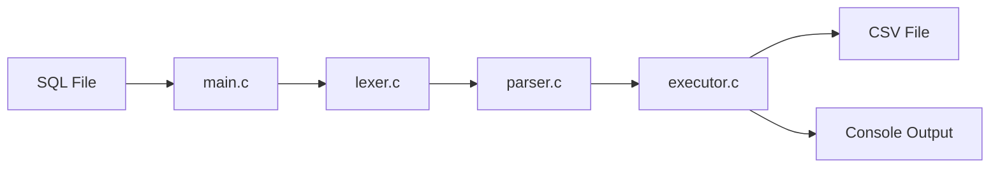

# SQLprocessor

> SQL 텍스트 파일을 입력받아 파싱하고, 실행하고, CSV 파일에 저장하는 C 기반 SQL 처리기입니다.


## 한눈에 보기

| 항목 | 내용 |
| --- | --- |
| 목표 | `입력(SQL)` -> `파싱` -> `실행` -> `파일 저장` 흐름 구현 |
| 언어 | C |
| 저장소 | CSV 파일 기반 |
| 필수 구현 | `INSERT`, `SELECT`, CLI 입력 |
| 추가 구현 | `UPDATE`, `DELETE`, `PK/UK/NN` 제약 |

## 처리 흐름



`main.c`는 SQL 파일을 문자 단위로 읽으면서 주석, 따옴표, 세미콜론을 구분해 문장을 분리합니다.  
이후 `lexer.c`와 `parser.c`가 SQL을 `Statement` 구조체로 바꾸고, `executor.c`가 실제 조회/삽입/수정/삭제를 수행합니다.

## 구현 핵심

| 구성 요소 | 역할 |
| --- | --- |
| `main.c` | 파일 경로 입력, SQL 문장 분리, 실행 분기 |
| `lexer.c` | SQL 문자열을 토큰으로 분해 |
| `parser.c` | `Statement` 구조체 생성 |
| `executor.c` | SELECT / INSERT / UPDATE / DELETE 실행 |
| `*.csv` | 테이블 데이터 저장 |

## 시연 순서

발표는 아래 순서로 진행하면 3분 30초 안에 핵심을 보여줄 수 있습니다.

```bash
gcc -fdiagnostics-color=always -g main.c -o sqlsprocessor

./sqlsprocessor demo_reset.sql
./sqlsprocessor demo_select.sql
./sqlsprocessor demo_insert.sql
./sqlsprocessor demo_insert_error.sql
./sqlsprocessor demo_update.sql
./sqlsprocessor demo_delete.sql
```

| 데모 파일 | 보여주는 내용 |
| --- | --- |
| `demo_reset.sql` | 기준 상태 복원 |
| `demo_select.sql` | 전체 조회 + 조건 조회 |
| `demo_insert.sql` | 신규 데이터 삽입 |
| `demo_insert_error.sql` | PK 중복, UK 중복 에러 |
| `demo_update.sql` | 조건 기반 수정 |
| `demo_delete.sql` | 조건 기반 삭제 |

## 차별점

- 최소 요구사항인 `INSERT`, `SELECT`를 넘어서 `UPDATE`, `DELETE`까지 구현했습니다.
- `PK`, `UK`, `NN` 제약을 실행 단계에서 검증합니다.
- `'tony,stark@test.com'`처럼 쉼표가 들어간 quoted 값도 처리합니다.
- 잘못된 SQL 문장과 제약 위반을 콘솔 메시지로 바로 확인할 수 있습니다.

## 발표에서 강조할 포인트

1. 이 프로젝트는 단순 CSV 편집기가 아니라 SQL을 해석하고 실행하는 작은 DB 처리기입니다.
2. 문자열을 바로 실행하지 않고 `파싱 -> 구조화 -> 실행` 단계를 분리했습니다.
3. 정상 흐름뿐 아니라 중복 INSERT 같은 예외 흐름도 테스트로 검증했습니다.

## 참고 문서

- [학습 가이드](docs/STUDY_GUIDE.md)
- [발표 대본](docs/PRESENTATION_SCRIPT.md)
