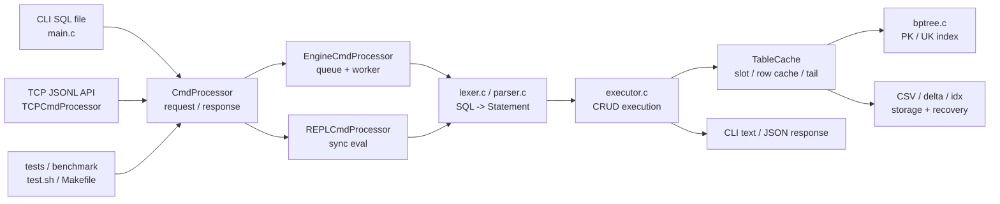

# SQL-B-Tree

C로 구현한 미니 SQL 처리기다. CSV 파일을 테이블처럼 사용하고, `INSERT`, `SELECT`, `UPDATE`, `DELETE`를 실행한다.

이 프로젝트의 핵심은 단순 CSV 스캔 처리기를 `B+ Tree 인덱스`, `append-only delta log`, `CmdProcessor 기반 요청 처리`, `TCP JSONL API`, `벤치/시연 도구`까지 갖춘 작은 DBMS 흐름으로 확장한 것이다.

이 README는 발표 흐름대로 읽히도록 구성했다. 하지만 빌드, 실행, 테스트 방법도 바로 찾을 수 있게 README 형식은 유지한다.

## 1. 프로젝트가 푸는 문제

처음 문제는 단순하다.

```text
대용량 CSV에서 특정 row를 찾을 때 매번 처음부터 끝까지 스캔하면 느리다.
```

그래서 현재 코드는 아래 방향으로 발전했다.

| 단계 | 해결한 문제 | 현재 구현 |
| --- | --- | --- |
| SQL subset | 입력을 SQL 문장으로 받는다 | `lexer.c`, `parser.c`, `Statement` |
| 실행 엔진 | SQL을 실제 CSV 테이블 작업으로 바꾼다 | `executor.c`, `TableCache` |
| 인덱스 | PK/UK exact lookup과 range lookup을 빠르게 한다 | `bptree.c` 숫자/문자열 B+ Tree |
| 저장 복구 | 변경분과 재시작 비용을 관리한다 | `*.csv`, `*.delta`, `*.idx` |
| 요청 처리 | CLI, REPL, TCP, 테스트가 같은 계약을 쓴다 | `CmdProcessor` |
| API 서버 | 외부 클라이언트가 JSONL로 SQL을 보낸다 | `TCPCmdProcessor` |
| 검증 | 기능, 동시성, 점수 측정을 반복한다 | `test.sh`, `benchmark_runner.c` |

한 줄로 말하면:

```text
SQL 요청 -> 공통 요청 처리기 -> parser/executor -> TableCache -> B+ Tree/CSV/delta -> 응답
```

## 2. 전체 프로젝트 한 장 요약



이 그림에서 발표의 큰 줄기는 세 개다.

1. 사용자는 SQL 파일, TCP API, 테스트/벤치 도구 중 하나로 들어온다.
2. 요청은 `CmdProcessor` 계약을 통과해 SQL 실행 계층으로 내려간다.
3. 실행 계층은 `TableCache`를 중심으로 B+ Tree 인덱스와 CSV 저장소를 함께 유지한다.

## 3. 요청 처리 계층: 왜 CmdProcessor가 있는가

`CmdProcessor`는 TCP, CLI, REPL, 테스트 코드가 SQL 실행 계층을 직접 붙잡지 않게 하는 공통 요청 처리 계약이다.


DOT 원본: [004_cmd_processor_overall_architecture.dot](docs/sijun-yang/diagrams/004_cmd_processor_overall_architecture.dot)

핵심은 역할 분리다.

| 구성 | 책임 |
| --- | --- |
| `CmdRequest` | 요청 id, 요청 타입, SQL 문자열 |
| `CmdResponse` | status, ok 여부, row/affected count, body/error |
| `CmdProcessor` | request 확보, submit, callback, release 규칙 |
| `EngineCmdProcessor` | queue/worker/lock plan 기반 운영용 처리 |
| `REPLCmdProcessor` | 동기 실행 흐름 |
| `MockCmdProcessor` | 계약 자체를 검증하는 테스트 구현체 |

`submit`이 성공했다는 말은 SQL 성공이 아니라 “요청 제출 성공”이다. 실제 SQL 결과는 callback으로 돌아오는 `CmdResponse`에 담긴다. 이 구조 덕분에 같은 SQL 엔진을 CLI, TCP API, 테스트 러너가 같은 방식으로 사용할 수 있다.

## 4. SQL 실행 흐름

SQL 한 문장은 아래 순서로 처리된다.

```text
SQL text
    -> lexer.c: token stream
    -> parser.c: Statement
    -> executor.c: 실행 계획 선택
    -> TableCache: row/cache/index/storage 접근
    -> 결과 row_count / affected_count / body
```

현재 지원하는 SQL 범위는 작지만 발표하기 좋게 경계가 분명하다.

| SQL | 예시 | 처리 방식 |
| --- | --- | --- |
| `INSERT` | `INSERT INTO users VALUES (...);` | 제약 검사 후 row append, PK/UK 인덱스 갱신 |
| `SELECT` | `SELECT * FROM users WHERE id = 10;` | PK/UK면 B+ Tree, 아니면 scan |
| `SELECT BETWEEN` | `SELECT * FROM users WHERE id BETWEEN 10 AND 20;` | PK/UK B+ Tree range scan |
| `UPDATE` | `UPDATE users SET status='done' WHERE id = 10;` | 인덱스 lookup 또는 scan 후 delta/rewrite |
| `DELETE` | `DELETE FROM users WHERE id = 10;` | 인덱스 lookup 또는 scan 후 delta/rewrite |

`WHERE`는 `=`와 `BETWEEN`을 지원하고, `AND`로 여러 조건을 묶을 수 있다. 이때 executor는 여러 조건 중 인덱스로 쓸 수 있는 조건을 먼저 고른 뒤, 나머지 조건은 row 필터로 확인한다.

## 5. 인덱스 전략

현재 인덱스의 기준은 CSV 헤더에 들어 있는 제약 표기다.

```csv
id(PK),email(UK),phone(UK),name,track(NN),background,history,pretest,github,status,round
```

| 컬럼 종류 | 자료구조 | 조회 경로 |
| --- | --- | --- |
| `PK` 숫자 컬럼 | numeric B+ Tree | `WHERE id = ?`, `WHERE id BETWEEN A AND B` |
| `UK` 문자열 컬럼 | string B+ Tree | `WHERE email = ?`, `WHERE phone BETWEEN A AND B` |
| 일반 컬럼 | 없음 | linear scan |
| `NN` 컬럼 | 제약 검사 | 빈 값 방지 |

발표에서 가장 중요한 비교는 이것이다.

```text
id / email / phone -> 인덱스 경로
name / status / 기타 일반 컬럼 -> 스캔 경로
```

B+ Tree는 `key -> slot id`를 찾는다. 실제 row 문자열은 `TableCache`의 slot, CSV offset, 또는 tail overlay에서 읽는다. 즉 B+ Tree는 데이터를 통째로 들고 있는 저장소가 아니라 “row 위치를 빠르게 찾는 지도”다.

## 6. 저장 구조: CSV를 DB처럼 다루기

저장소는 세 파일로 나뉜다.

| 파일 | 역할 |
| --- | --- |
| `table.csv` | 기본 테이블 데이터 |
| `table.delta` | `UPDATE` / `DELETE` 변경분을 append-only로 기록 |
| `table.idx` | CSV parse 결과와 B+ Tree 인덱스 스냅샷 |

`TableCache`는 이 세 파일을 한 번에 묶어서 관리한다.

```text
TableCache
    columns / constraints
    active slot list
    row cache
    PK B+ Tree
    UK B+ Trees
    CSV row offsets
    uncached tail index
    delta overlay
```

메모리 모델은 두 단계다.

| 구간 | 처리 방식 |
| --- | --- |
| cache prefix | 최대 `MAX_RECORDS` 2,000,000개 slot을 기준으로 인덱스와 row 참조 유지 |
| uncached tail | 그 이후 row는 CSV에 남기고, PK exact lookup은 tail offset index로 접근 |

그래서 전체 CSV를 무조건 row 문자열로 들고 있지 않는다. 대용량에서는 필요한 row만 materialize하고, tail은 CSV offset과 delta overlay로 보완한다.

## 7. 쓰기 경로: append, delta, fallback

쓰기 계층의 목표는 “인덱스와 저장소가 서로 어긋나지 않게 하는 것”이다.

| 작업 | 핵심 흐름 |
| --- | --- |
| `INSERT` | row 생성 -> PK/UK/NN 검사 -> CSV append -> B+ Tree 갱신 |
| `UPDATE` | 대상 row 찾기 -> PK 변경 방지 -> UK 중복 검사 -> row 교체 -> delta append |
| `DELETE` | 대상 row 찾기 -> active flag 해제 -> 인덱스/slot 정리 -> delta append |
| fallback | delta를 쓸 수 없거나 tail 조건이 복잡하면 CSV rewrite |

삭제 후에도 인덱스가 stale row를 가리키지 않도록 slot 활성 상태와 free slot 목록을 따로 관리한다. tail row의 `UPDATE` / `DELETE`는 CSV 원본을 바로 덮어쓰지 않고 delta overlay로 반영한다.

## 8. TCP API 흐름

TCP 계층은 DB가 아니다. socket을 받고, newline으로 구분된 JSON 요청을 `CmdRequest`로 바꿔 뒤쪽 processor에 맡기는 어댑터다.


DOT 원본: [004_tcp_cmd_processor_architecture_flow.dot](docs/sijun-yang/diagrams/004_tcp_cmd_processor_architecture_flow.dot)

프로토콜은 JSONL이다.

요청 예:

```json
{"id":"s1","op":"sql","sql":"SELECT * FROM users WHERE id = 1;"}
{"id":"p1","op":"ping"}
{"id":"c1","op":"close"}
```

응답 예:

```json
{"id":"p1","ok":true,"status":"OK","body":"pong"}
{"id":"s1","ok":true,"status":"OK","row_count":1,"body":"SELECT matched_rows=1"}
{"id":"bad","ok":false,"status":"BAD_REQUEST","error":"missing sql"}
```

TCP 계층이 관리하는 것은 세 가지다.

| 상태 | 의미 |
| --- | --- |
| `connections` | 현재 열린 TCP connection 목록 |
| `client_counters` | client별 connection 수와 in-flight 수 |
| `inflight_ids` | 아직 callback이 돌아오지 않은 request id 목록 |

## 9. 여러 요청이 동시에 들어오면

같은 connection 안에서도 여러 요청이 in-flight 상태가 될 수 있다.


DOT 원본: [004_tcp_multi_request_inflight_flow.dot](docs/sijun-yang/diagrams/004_tcp_multi_request_inflight_flow.dot)

중요한 점은 응답 순서다.

```text
r1을 먼저 보냈어도 r2가 먼저 끝나면 r2 응답이 먼저 올 수 있다.
클라이언트는 반드시 response.id로 요청과 응답을 매칭해야 한다.
```

중복 in-flight id, connection별 in-flight 초과, client별 in-flight 초과는 TCP 계층에서 거절한다. 실제 SQL 실행 병렬성은 뒤쪽의 `EngineCmdProcessor` queue/worker 모델이 담당한다.

## 10. 발표용 시연 포인트

발표에서 가장 자연스러운 흐름은 아래 순서다.

1. CSV만 스캔하면 대용량에서 느리다는 문제를 제시한다.
2. `id(PK)`, `email(UK)`, `phone(UK)`를 B+ Tree 인덱스로 바꾼다.
3. `SELECT WHERE id = ?`와 `SELECT WHERE name = ?`를 비교해 index path와 scan path를 보여준다.
4. `BETWEEN`으로 B+ Tree leaf range scan의 장점을 설명한다.
5. `UPDATE` / `DELETE`가 delta log와 slot 상태를 통해 저장소와 인덱스를 같이 유지한다는 점을 설명한다.
6. 같은 엔진이 TCP JSONL API 뒤에서도 동작한다는 것을 `CmdProcessor`로 연결한다.
7. `test.sh`로 API 서버, 외부 클라이언트, 동시 요청, B+ Tree 제약 검증을 한 번에 보여준다.
8. `make bench-score`로 성능/정확성 리포트까지 재현 가능하다는 점으로 마무리한다.

## 11. 빌드와 실행

기본 빌드:

```bash
make
```

또는 단일 컴파일:

```bash
gcc -O2 -fdiagnostics-color=always -g main.c -o sqlsprocessor
```

메모리 추적 빌드:

```bash
gcc -O2 -fdiagnostics-color=always -g -DBENCH_MEMTRACK main.c -o sqlsprocessor
BENCH_MEMTRACK_REPORT=1 ./sqlsprocessor --quiet demo_bptree.sql
```

SQL 파일 실행:

```bash
./sqlsprocessor demo_bptree.sql
```

조용한 실행:

```bash
./sqlsprocessor --quiet demo_bptree.sql
```

정글 데이터셋 생성:

```bash
./sqlsprocessor --generate-jungle 1000000
./sqlsprocessor --generate-jungle 1000000 my_jungle_demo.csv
```

기본 벤치:

```bash
./sqlsprocessor --benchmark 1000000
./sqlsprocessor --benchmark-jungle 1000000
```

기본 정글 데이터셋 파일은 `jungle_benchmark_users.csv`다. 발표에서 쓰기 좋은 비교 컬럼은 `id(PK)`, `email(UK)`, `phone(UK)`, `name`이다. 앞의 세 컬럼은 인덱스 경로, `name`은 scan 경로를 보여준다.

## 12. 테스트와 벤치마크

핵심 테스트:

```bash
make test-cmd-processor
make test-repl-cmd-processor
make test-tcp-cmd-processor
make test-cmd-processor-scale-score
```

발표용 API story test:

```bash
./test.sh
./test.sh --stress
```

`./test.sh`는 TCP API 서버를 띄우고, 외부 클라이언트처럼 JSONL 요청을 보내 `INSERT -> SELECT -> UPDATE -> DELETE`, UK 중복 방어, malformed request 방어, 동시 주문 처리를 검증한다.

점수형 벤치:

```bash
make bench-smoke
make bench-score
make bench-report
```

시나리오와 workload:

```bash
make scenario-jungle-regression
make scenario-jungle-range-and-replay
make scenario-jungle-update-constraints
make generate-jungle-sql
```

주요 산출물:

```text
generated_sql/workload_smoke.sql
generated_sql/workload_regression.sql
generated_sql/workload_score.sql
artifacts/bench/report.json
artifacts/bench/report.md
artifacts/api_story_test/output.log
artifacts/api_story_test/runtime/*.csv
artifacts/api_story_test/runtime/*.delta
artifacts/api_story_test/runtime/*.idx
```

## 13. 파일 구조

읽기 시작점은 아래 순서가 좋다.

| 위치 | 역할 |
| --- | --- |
| `main.c` | CLI 옵션, SQL 파일 읽기, EngineCmdProcessor 초기화 |
| `lexer.c`, `parser.c` | SQL text를 `Statement`로 변환 |
| `executor.c`, `executor.h` | CRUD 실행, TableCache, CSV/delta/snapshot/index 연동 |
| `bptree.c`, `bptree.h` | 숫자 PK B+ Tree, 문자열 UK B+ Tree |
| `types.h` | `Statement`, `TableCache`, token, column metadata |
| `cmd_processor/` | 공통 요청 처리 계약, Engine/REPL/TCP/Mock 구현 |
| `thirdparty/cjson/` | TCP JSON request/response 처리 |
| `benchmark_runner.c` | correctness/benchmark/report 실행기 |
| `bench_workload_generator.c` | 벤치 SQL workload 생성 |
| `tests/api_story_test.c` | 발표용 TCP API story test runner |
| `docs/sijun-yang/004_cmd_processor_architecture_flow.md` | CmdProcessor/TCP 상세 발표 문서 |

## 14. Make targets

```bash
make
make demo-bptree
make generate-jungle
make demo-jungle
make scenario-jungle-regression
make scenario-jungle-range-and-replay
make scenario-jungle-update-constraints
make generate-jungle-sql
make benchmark
make benchmark-jungle
make bench-smoke
make bench-score
make bench-report
make bench-clean
```

## 15. 발표 후 Q&A 대비

자주 받을 질문에 대한 짧은 답은 아래처럼 정리할 수 있다.

| 질문 | 답 |
| --- | --- |
| 왜 B+ Tree인가? | exact lookup뿐 아니라 `BETWEEN` range scan을 같은 인덱스로 설명할 수 있기 때문이다. |
| 왜 모든 컬럼을 인덱싱하지 않았나? | 인덱스 경로와 scan 경로의 차이를 보여주고, 메모리/갱신 비용을 통제하기 위해 PK/UK 중심으로 제한했다. |
| CSV인데 DBMS라고 할 수 있나? | 저장 포맷은 CSV지만 SQL parser, executor, index, mutation log, request processor를 갖춘 작은 DBMS 구조다. |
| DELETE 후 인덱스가 깨지지 않나? | slot active 상태, free slot, index 삭제/재구성, delta replay로 stale row를 방지한다. |
| TCP 응답 순서가 달라져도 괜찮나? | response의 `id`가 요청 id와 같기 때문에 클라이언트가 id로 매칭한다. |
| 재실행하면 인덱스를 다시 다 만드나? | 가능한 경우 `*.idx` snapshot을 읽고, 변경분은 `*.delta`를 replay한다. |

추가로 그리면 좋은 시각화 후보:

```text
VISUALIZATION-TODO: B+ Tree leaf next pointer를 따라가는 BETWEEN range scan 그림
VISUALIZATION-TODO: CSV + delta + idx가 reopen 때 합쳐지는 recovery 흐름 그림
```
