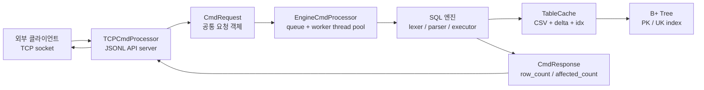
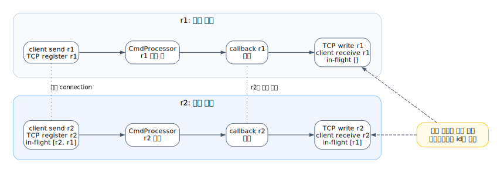
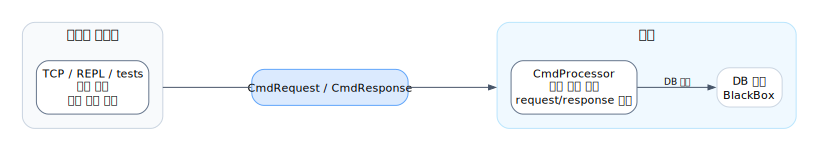

# 미니 DBMS - API 서버

이 프로젝트는 **미니 DBMS - API 서버** 구현 결과물이다. C로 TCP API 서버를 만들고, 외부 클라이언트가 JSONL 요청으로 SQL을 보내면 내부 SQL 처리기와 B+ Tree 인덱스를 통해 DBMS 기능을 사용할 수 있게 했다.

이 구현의 핵심은 두가지다.
- 외부 API 서버에서 들어오는 요청을 스레드풀 기반으로 처리하도록 했다.
- 기존 SQL 처리기와 B+ Tree 인덱스 구조는 변경하지 않고 재사용했다.

## 1. 발표 흐름 한 장 요약



1. 외부 클라이언트가 TCP API 서버에 JSONL 요청을 보낸다.
2. TCP 계층은 JSON을 검증하고 `CmdRequest`로 변환한다.
3. `EngineCmdProcessor`가 요청을 queue에 넣고 worker thread가 SQL을 처리한다.
4. SQL 엔진은 기존 `lexer/parser/executor`와 B+ Tree 인덱스를 그대로 사용한다.
5. 응답은 같은 request id를 가진 JSON response로 돌아간다.
6. `./test.sh`와 `./test.sh --stress`로 기능과 동시성을 데모한다.

## 2. API 서버 아키텍처

API 서버는 새로운 DB 엔진이 아닌, 기존 DB-Cmd Processor를 위한 네트워크 어댑터다. TCP 소켓으로 수신한 JSONL 요청을 CmdRequest로 변환하고, SQL 처리와 B+ Tree 인덱스 접근은 기존 Processor에 위임한다.


DOT 원본: [004_tcp_cmd_processor_architecture_flow.dot](docs/sijun-yang/diagrams/004_tcp_cmd_processor_architecture_flow.dot)

API 서버가 담당하는 일은 네 가지다.

| 책임 | 설명 |
| --- | --- |
| connection 관리 | listen socket, client socket, connection list, client별 제한 |
| request parsing | JSONL 한 줄을 읽고 `id`, `op`, `sql` 필드를 검증 |
| in-flight 추적 | 아직 응답이 오지 않은 request id를 connection별로 관리 |
| response 직렬화 | `CmdResponse`를 JSON 한 줄로 바꿔 같은 connection에 write |

프로토콜은 JSONL이다.

```json
{"id":"s1","op":"sql","sql":"SELECT * FROM users WHERE id = 1;"}
{"id":"p1","op":"ping"}
{"id":"c1","op":"close"}
```

응답은 항상 request id를 포함한다.

```json
{"id":"p1","ok":true,"status":"OK","body":"pong"}
{"id":"s1","ok":true,"status":"OK","row_count":1,"body":"SELECT matched_rows=1"}
{"id":"bad","ok":false,"status":"BAD_REQUEST","error":"missing sql"}
```

## 3. 스레드풀과 동시성

핵심 요구사항은 요청마다 스레드를 할당해 SQL을 병렬 처리하는 것이다. 다만 이 구현에서는 connection thread가 SQL을 직접 처리하지 않고, EngineCmdProcessor의 queue/worker 모델에 위임한다.

```text
> 1. TCP connection thread가 요청을 수신하고 검증한다.
> 2. 요청을 in-flight로 등록한 뒤 Engine queue에 제출한다.
> 3. worker thread가 SQL을 실행하고, callback을 통해 TCP response를 반환한다.
```

같은 connection 안에서도 여러 요청이 in-flight 상태가 될 수 있다.



DOT 원본: [004_tcp_multi_request_inflight_flow.dot](docs/sijun-yang/diagrams/004_tcp_multi_request_inflight_flow.dot)

동시성에서 중요한 규칙은 아래와 같다.

| 이슈 | 처리 방식 |
| --- | --- |
| 응답 순서 역전 | response의 `id`로 요청과 응답을 매칭한다 |
| 중복 request id | 같은 connection의 in-flight 목록에 이미 있으면 `BAD_REQUEST` |
| connection 과다 | 전체 connection 수와 client별 connection 수를 제한한다 |
| in-flight 과다 | connection별/client별 in-flight 수를 제한하고 `BUSY` 응답 |
| SQL 실행 충돌 | Engine layer에서 request plan과 lock plan으로 처리 순서를 제어한다 |

즉 이 구현은 "스레드를 만들었다"에 그치지 않고, **요청 추적, 큐잉, worker 처리, callback 응답, 과부하 방어**까지 포함한 동시성 구조다.

## 4. API 서버와 내부 DB 엔진 연결

`CmdProcessor`는 TCP, CLI, REPL, 테스트 코드 등 모든 클라이언트가 SQL 처리 로직에 직접 의존하지 않도록 하는 공통 인터페이스다.



DOT 원본: [004_cmd_processor_overall_architecture.dot](docs/sijun-yang/diagrams/004_cmd_processor_overall_architecture.dot)

핵심은 역할 분리다.

| 구성 | 책임 |
| --- | --- |
| `CmdRequest` | 요청 id, 요청 타입, SQL 문자열 |
| `CmdResponse` | status, ok 여부, row/affected count, body/error |
| `CmdProcessor` | request 확보, submit, callback, release 규칙 |
| `EngineCmdProcessor` | queue/worker/lock plan 기반 운영용 처리 |
| `REPLCmdProcessor` | 동기 실행 흐름 |
| `MockCmdProcessor` | 계약 자체를 검증하는 테스트 구현체 |

- submit의 반환값은 SQL 실행 성공이 아닌 요청 제출 성공을 의미한다. 실제 SQL 결과는 비동기로 돌아오는 CmdResponse callback에 담긴다.
- 즉 호출자는 결과를 기다리지 않고 제출만 하면 되고, 결과 처리는 callback에 맡긴다. 
- 이 비동기 구조 덕분에 CLI, TCP API, 테스트 러너가 동일한 인터페이스로 같은 SQL 엔진을 사용할 수 있다.

## 5. 내부 DB 엔진: 기존 SQL 처리기 재사용

SQL 한 문장은 아래 순서로 처리된다.

```text
SQL text
    -> lexer.c: token stream
    -> parser.c: Statement
    -> executor.c: 실행 계획 선택
    -> TableCache: row/cache/index/storage 접근
    -> 결과 row_count / affected_count / body
```

| SQL | 예시 | 처리 방식 |
| --- | --- | --- |
| `INSERT` | `INSERT INTO users VALUES (...);` | 제약 검사 후 row append, PK/UK 인덱스 갱신 |
| `SELECT` | `SELECT * FROM users WHERE id = 10;` | PK/UK면 B+ Tree, 아니면 scan |
| `SELECT BETWEEN` | `SELECT * FROM users WHERE id BETWEEN 10 AND 20;` | PK/UK B+ Tree range scan |
| `UPDATE` | `UPDATE users SET status='done' WHERE id = 10;` | 인덱스 lookup 또는 scan 후 delta/rewrite |
| `DELETE` | `DELETE FROM users WHERE id = 10;` | 인덱스 lookup 또는 scan 후 delta/rewrite |

`WHERE`는 `=`와 `BETWEEN`을 지원하고, `AND`로 여러 조건을 묶을 수 있다. 이때 executor는 여러 조건 중 인덱스로 쓸 수 있는 조건을 먼저 고른 뒤, 나머지 조건은 row 필터로 확인한다.

## 7. B+ Tree 인덱스 전략

현재 인덱스의 기준은 CSV 헤더에 들어 있는 제약 표기다.

```csv
id(PK),email(UK),phone(UK),name,track(NN),background,history,pretest,github,status,round
```

| 컬럼 종류 | 자료구조 | 조회 경로 |
| --- | --- | --- |
| `PK` 숫자 컬럼 | numeric B+ Tree | `WHERE id = ?`, `WHERE id BETWEEN A AND B` |
| `UK` 문자열 컬럼 | string B+ Tree | `WHERE email = ?`, `WHERE phone BETWEEN A AND B` |
| 일반 컬럼 | 없음 | linear scan |
| `NN` 컬럼 | 제약 검사 | 빈 값 방지 |

발표에서 가장 중요한 비교는 이것이다.

```text
id / email / phone -> 인덱스 경로
name / status / 기타 일반 컬럼 -> 스캔 경로
```

B+ Tree는 `key -> slot id`를 찾는다. 실제 row 문자열은 `TableCache`의 slot, CSV offset, 또는 tail overlay에서 읽는다. 즉 B+ Tree는 데이터를 통째로 들고 있는 저장소가 아니라 “row 위치를 빠르게 찾는 지도”다.

## 8. 저장 구조: CSV를 DB처럼 다루기

저장소는 세 파일로 나뉜다.

| 파일 | 역할 |
| --- | --- |
| `table.csv` | 기본 테이블 데이터 |
| `table.delta` | `UPDATE` / `DELETE` 변경분을 append-only로 기록 |
| `table.idx` | CSV parse 결과와 B+ Tree 인덱스 스냅샷 |

`TableCache`는 이 세 파일을 한 번에 묶어서 관리한다.

```text
TableCache
    columns / constraints
    active slot list
    row cache
    PK B+ Tree
    UK B+ Trees
    CSV row offsets
    uncached tail index
    delta overlay
```

메모리 모델은 두 단계다.

| 구간 | 처리 방식 |
| --- | --- |
| cache prefix | 최대 `MAX_RECORDS` 2,000,000개 slot을 기준으로 인덱스와 row 참조 유지 |
| uncached tail | 그 이후 row는 CSV에 남기고, PK exact lookup은 tail offset index로 접근 |

그래서 전체 CSV를 무조건 row 문자열로 들고 있지 않는다. 대용량에서는 필요한 row만 materialize하고, tail은 CSV offset과 delta overlay로 보완한다.

## 9. 쓰기 경로: append, delta, fallback

쓰기 계층의 목표는 “인덱스와 저장소가 서로 어긋나지 않게 하는 것”이다.

| 작업 | 핵심 흐름 |
| --- | --- |
| `INSERT` | row 생성 -> PK/UK/NN 검사 -> CSV append -> B+ Tree 갱신 |
| `UPDATE` | 대상 row 찾기 -> PK 변경 방지 -> UK 중복 검사 -> row 교체 -> delta append |
| `DELETE` | 대상 row 찾기 -> active flag 해제 -> 인덱스/slot 정리 -> delta append |
| fallback | delta를 쓸 수 없거나 tail 조건이 복잡하면 CSV rewrite |

삭제 후에도 인덱스가 stale row를 가리키지 않도록 slot 활성 상태와 free slot 목록을 따로 관리한다. tail row의 `UPDATE` / `DELETE`는 CSV 원본을 바로 덮어쓰지 않고 delta overlay로 반영한다.

## 10. 데모와 검증 흐름

발표에서 가장 자연스러운 흐름은 아래 순서다.

1. `./test.sh`가 C 테스트 러너를 빌드하고 내부에서 TCP API 서버를 실제로 띄운다.
2. 테스트 러너가 외부 클라이언트처럼 socket을 열고 JSONL 요청을 보낸다.
3. `ping`으로 서버 생존을 확인한 뒤 `INSERT -> SELECT -> UPDATE -> DELETE`를 API 요청으로 검증한다.
4. UK 중복, malformed JSON, SQL 누락 같은 실패 케이스가 `BAD_REQUEST` 또는 실패 응답으로 정리되는지 확인한다.
5. 여러 클라이언트 thread가 동시에 요청을 보내고, request id별 응답 매칭과 in-flight 처리를 검증한다.
6. `./test.sh --stress`로 키오스크 4대가 window=16 병렬 요청을 밀어 넣는 부하 장면을 보여준다.
7. 마지막에 `make test-*`와 `make bench-score`로 단위 테스트, TCP 테스트, 성능/정확성 리포트를 재현할 수 있음을 보여준다.

데모 메시지는 이렇게 잡는다.

```text
이 프로젝트는 SQL 처리기만 만든 것이 아니라,
외부 클라이언트가 접속할 수 있는 C 기반 TCP API 서버,
스레드풀 요청 처리,
기존 SQL 엔진/B+ Tree 재사용,
그리고 기능/동시성/엣지 케이스 테스트까지 묶어서 구현했다.
```

## 11. 빌드와 실행

기본 빌드:

```bash
make
```

또는 단일 컴파일:

```bash
gcc -O2 -fdiagnostics-color=always -g main.c -o sqlsprocessor
```

메모리 추적 빌드:

```bash
gcc -O2 -fdiagnostics-color=always -g -DBENCH_MEMTRACK main.c -o sqlsprocessor
BENCH_MEMTRACK_REPORT=1 ./sqlsprocessor --quiet demo_bptree.sql
```

SQL 파일 실행:

```bash
./sqlsprocessor demo_bptree.sql
```

조용한 실행:

```bash
./sqlsprocessor --quiet demo_bptree.sql
```

정글 데이터셋 생성:

```bash
./sqlsprocessor --generate-jungle 1000000
./sqlsprocessor --generate-jungle 1000000 my_jungle_demo.csv
```

기본 벤치:

```bash
./sqlsprocessor --benchmark 1000000
./sqlsprocessor --benchmark-jungle 1000000
```

기본 정글 데이터셋 파일은 `jungle_benchmark_users.csv`다. 발표에서 쓰기 좋은 비교 컬럼은 `id(PK)`, `email(UK)`, `phone(UK)`, `name`이다. 앞의 세 컬럼은 인덱스 경로, `name`은 scan 경로를 보여준다.

## 12. 테스트와 벤치마크

품질 요구사항은 아래처럼 검증한다.

| 검증 대상 | 실행 | 확인하는 것 |
| --- | --- | --- |
| 공통 요청 계약 | `make test-cmd-processor` | request/response 소유권, status, callback, 동시 submit |
| REPL 처리기 | `make test-repl-cmd-processor` | 동기 SQL 실행, parse error, processing error |
| TCP API 서버 | `make test-tcp-cmd-processor` | JSONL request/response, connection 제한, in-flight 제한 |
| 스레드풀 처리량 | `make test-cmd-processor-scale-score` | queue wait, worker 처리, request slot 사용량 |
| 발표용 E2E | `./test.sh` | 외부 클라이언트 관점의 CRUD, UK 중복, bad request, 동시 요청 |
| 병렬 부하 | `./test.sh --stress` | 여러 클라이언트가 outstanding 요청을 유지할 때의 안정성 |
| 점수형 벤치 | `make bench-score` | correctness, benchmark, memory tracking, report 생성 |

핵심 테스트:

```bash
make test-cmd-processor
make test-repl-cmd-processor
make test-tcp-cmd-processor
make test-cmd-processor-scale-score
```

발표용 API story test:

```bash
./test.sh
./test.sh --stress
```

`./test.sh`는 TCP API 서버를 띄우고, 외부 클라이언트처럼 JSONL 요청을 보내 `INSERT -> SELECT -> UPDATE -> DELETE`, UK 중복 방어, malformed request 방어, 동시 주문 처리를 검증한다.

점수형 벤치:

```bash
make bench-smoke
make bench-score
make bench-report
```

시나리오와 workload:

```bash
make scenario-jungle-regression
make scenario-jungle-range-and-replay
make scenario-jungle-update-constraints
make generate-jungle-sql
```

주요 산출물:

```text
generated_sql/workload_smoke.sql
generated_sql/workload_regression.sql
generated_sql/workload_score.sql
artifacts/bench/report.json
artifacts/bench/report.md
artifacts/api_story_test/output.log
artifacts/api_story_test/runtime/*.csv
artifacts/api_story_test/runtime/*.delta
artifacts/api_story_test/runtime/*.idx
```

## 13. 파일 구조

읽기 시작점은 아래 순서가 좋다.

| 위치 | 역할 |
| --- | --- |
| `main.c` | CLI 옵션, SQL 파일 읽기, EngineCmdProcessor 초기화 |
| `lexer.c`, `parser.c` | SQL text를 `Statement`로 변환 |
| `executor.c`, `executor.h` | CRUD 실행, TableCache, CSV/delta/snapshot/index 연동 |
| `bptree.c`, `bptree.h` | 숫자 PK B+ Tree, 문자열 UK B+ Tree |
| `types.h` | `Statement`, `TableCache`, token, column metadata |
| `cmd_processor/` | 공통 요청 처리 계약, Engine/REPL/TCP/Mock 구현 |
| `thirdparty/cjson/` | TCP JSON request/response 처리 |
| `benchmark_runner.c` | correctness/benchmark/report 실행기 |
| `bench_workload_generator.c` | 벤치 SQL workload 생성 |
| `tests/api_story_test.c` | 발표용 TCP API story test runner |
| `docs/sijun-yang/004_cmd_processor_architecture_flow.md` | CmdProcessor/TCP 상세 발표 문서 |

## 14. Make targets

```bash
make
make demo-bptree
make generate-jungle
make demo-jungle
make scenario-jungle-regression
make scenario-jungle-range-and-replay
make scenario-jungle-update-constraints
make generate-jungle-sql
make benchmark
make benchmark-jungle
make bench-smoke
make bench-score
make bench-report
make bench-clean
```

## 15. 발표 후 Q&A 대비

자주 받을 질문에 대한 짧은 답은 아래처럼 정리할 수 있다.

| 질문 | 답 |
| --- | --- |
| API 서버는 실제로 외부 접속을 받나? | `TCPCmdProcessor`가 TCP listen socket을 열고, 테스트 러너가 별도 client socket으로 JSONL 요청을 보낸다. |
| 스레드풀은 어디에 있나? | `EngineCmdProcessor`가 queue와 worker thread를 만들고, TCP connection thread는 SQL을 직접 실행하지 않고 submit만 한다. |
| 동시 요청의 응답 순서가 바뀌면? | response의 `id`가 요청 id와 같기 때문에 클라이언트가 id로 매칭한다. |
| 잘못된 API 요청은 어떻게 되나? | malformed JSON, 필수 필드 누락, SQL 길이 초과, 중복 in-flight id는 DB 실행 전에 실패 응답으로 정리한다. |
| 왜 B+ Tree인가? | exact lookup뿐 아니라 `BETWEEN` range scan을 같은 인덱스로 설명할 수 있기 때문이다. |
| 왜 모든 컬럼을 인덱싱하지 않았나? | 인덱스 경로와 scan 경로의 차이를 보여주고, 메모리/갱신 비용을 통제하기 위해 PK/UK 중심으로 제한했다. |
| CSV인데 DBMS라고 할 수 있나? | 저장 포맷은 CSV지만 SQL parser, executor, index, mutation log, request processor를 갖춘 작은 DBMS 구조다. |
| DELETE 후 인덱스가 깨지지 않나? | slot active 상태, free slot, index 삭제/재구성, delta replay로 stale row를 방지한다. |
| 재실행하면 인덱스를 다시 다 만드나? | 가능한 경우 `*.idx` snapshot을 읽고, 변경분은 `*.delta`를 replay한다. |

추가로 그리면 좋은 시각화 후보:

```text
VISUALIZATION-TODO: B+ Tree leaf next pointer를 따라가는 BETWEEN range scan 그림
VISUALIZATION-TODO: CSV + delta + idx가 reopen 때 합쳐지는 recovery 흐름 그림
```
