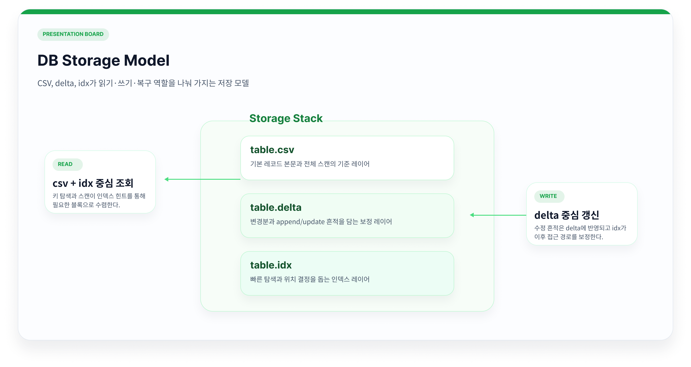
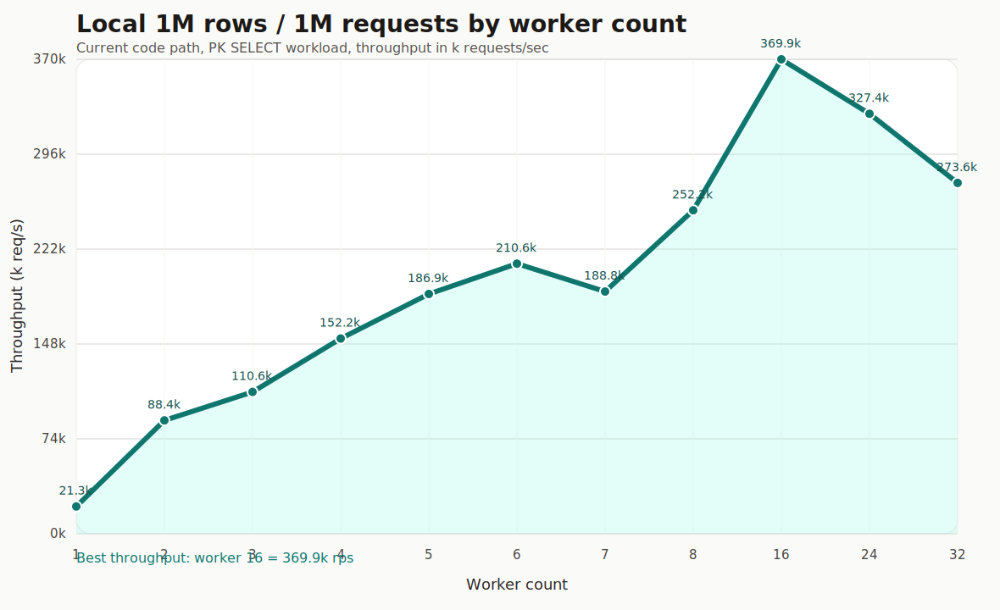

# 미니 DBMS - API 서버

이 프로젝트는 **C로 구현한 미니 DBMS - API 서버**다. 외부 클라이언트가 TCP socket으로 JSONL 요청을 보내면, 서버는 그 요청을 내부 DB 엔진으로 전달하고 기존 SQL 처리기와 B+ Tree 인덱스로 결과를 반환한다.

## 1. 개요

### 전체 구조


- C 언어로 미니 DBMS API 서버를 구현했다.
- 외부 클라이언트는 TCP connection으로 JSONL 요청을 보내 DBMS 기능을 사용할 수 있다.
- 요청은 Thread Pool 흐름으로 처리되어 여러 클라이언트 요청을 동시에 받을 수 있다.
- 내부 DB 엔진은 이전 차수에서 구현한 SQL 처리기와 B+ Tree 인덱스를 재사용한다.
- 테스트와 부하 시연으로 기능, 엣지 케이스, 동시 요청 흐름을 검증한다.

**핵심은 동시 요청을 두 단계로 나눠 처리한 것이다. API는 요청을 추적하고, DB는 공유 데이터의 일관성을 보장한다.**

## 발표용 최소 시연

발표 환경은 VS Code devcontainer/Linux 기준으로 고정한다. 준비 단계와 발표 실행 단계를 분리해서, 발표 중에는 빌드/fixture 생성/warmup 없이 준비된 workload만 실행한다.

### 1. 발표 전 준비

```sh
make demo-score-prepare
```

기본값은 발표용으로 `1M rows / 200k mixed ops / 30초 제한`이다. 1M rows / 1M mixed ops는 Docker devcontainer에서 30초를 넘을 수 있으므로 발표용 기본값으로 쓰지 않는다.

무거운 1M/1M 검증을 따로 하고 싶을 때만 아래처럼 변수만 붙인다.

```sh
make demo-score-prepare DEMO_SCORE_OPS=1000000 DEMO_SCORE_TIMEOUT=300
```

준비 단계는 devcontainer 안에서 아래 작업을 수행하고 `artifacts/demo-score-fixture/`에 결과를 남긴다.

- `make -B build bench-tools`로 현재 소스를 강제 재빌드한다.
- score fixture를 생성한다.
- 초기 행은 SQL INSERT 재생 대신 CSV fixture copy + index warmup으로 준비한다.
- 실행용 `sqlsprocessor`, `demo_worker_sweep`, `workload_score.sql`, CSV, `.idx` snapshot을 fixture에 고정한다.

### 2. 발표 중 실행

발표 중에는 아래 명령만 실행한다.

```sh
make demo-presentation-run
```

짧은 발표 멘트와 해석은 [docs/DEMO_PRESENTATION_RUN_KO.md](docs/DEMO_PRESENTATION_RUN_KO.md)에 정리했다.

이 명령은 준비된 fixture를 임시 실행 디렉터리에 timestamp 보존 복사한 뒤 실행만 한다.

- `demo-score-run`: score workload timed run
- `demo-worker-sweep-run`: worker count 8/16/32 SELECT 처리량 비교
- 결과: `artifacts/demo-score/report.svg`, `artifacts/demo-worker-sweep/report.svg`

score만 보여주려면:

```sh
make demo-score-run
```

worker 8/16/32만 보여주려면:

```sh
make demo-worker-sweep-run
```

기존처럼 pull 직후 `./sqlsprocessor generated_sql/workload_score.sql > /dev/null`를 바로 실행하지 않는다. `sqlsprocessor`, workload, CSV, `.idx` snapshot을 같은 fixture에서 맞춰야 한다.

초기 적재 자체를 INSERT 경로로 검증하고 싶을 때만 아래처럼 느린 모드를 켠다.

```sh
make demo-score-prepare DEMO_SCORE_PRELOAD_MODE=insert
```

### 3. DB worker 이전 경계 속도

필요하면 네이티브 Linux에서 worker 경계와 회귀 테스트도 같이 보여준다.

```sh
make pre-worker-bench
make test-engine-cmd-processor
```

- `pre-worker-bench`는 `CmdProcessor acquire/set/submit/release`만 측정한다.
- hot shard read에서도 여러 worker가 실제로 일하도록 바뀐 상태를 보여준다.
- same-table read/read 병렬성과 duplicate/read-write correctness 회귀를 함께 확인할 수 있다.

### 4. 외부 TCP는 보조 시연

외부 TCP 시연이 필요하면 아래 문서와 스크립트를 사용한다.

- [docs/K6_TCP_BINARY_BENCH_KO.md](docs/K6_TCP_BINARY_BENCH_KO.md)
- [scripts/run_k6_tcp_binary_bench.ps1](scripts/run_k6_tcp_binary_bench.ps1)

발표에서는 DB/worker가 주역이면, 외부 TCP는 "별도 벤치 경로 준비됨" 정도로만 짚는 편이 깔끔하다.

## 2. API

TCP 서버는 SQL을 직접 실행하지 않는다. 외부 요청을 수신해 DB 처리 계층으로 넘기는 경계 역할을 한다.

### API 서버 아키텍처


DOT 원본: [004_tcp_cmd_processor_architecture_flow.dot](docs/sijun-yang/diagrams/004_tcp_cmd_processor_architecture_flow.dot)

- 외부 클라이언트는 TCP connection을 열고 JSONL 한 줄로 SQL 요청을 보낸다.
- API 서버는 요청을 수신하면 request id를 기록하고 결과가 돌아올 때까지 추적한다.
- SQL은 API 서버에서 직접 실행하지 않고 DB 처리 계층으로 전달한다.
- 결과가 돌아오면 동일한 request id로 원래 connection에 응답한다. 응답 순서가 바뀌어도 클라이언트는 request id로 자신의 응답을 찾을 수 있다.
- 잘못된 JSON, 필수 필드 누락, 중복 id 등 DB까지 전달할 필요가 없는 요청은 API 계층에서 먼저 차단한다.

### API 계층의 동시성

- 여러 클라이언트 connection과 여러 in-flight 요청이 동시에 존재할 수 있다.
- 여기서의 동시성은 DB 내부의 lock 문제가 아니라, 동시에 들어온 네트워크 요청을 누락 없이 올바른 응답에 매칭하는 문제다.

**즉, API 계층의 동시성은 DB lock이 아닌 요청 추적과 응답 매칭의 문제다.**

## 3. DB

API가 요청을 동시에 받아들이면, DB 계층은 공유 데이터에 대한 접근 순서를 제어해야 한다.



### API와 DB 실행 경계
- API 계층은 SQL을 직접 실행하지 않는다.
- SQL 요청은 DB 처리 계층으로 넘어가며, 이 계층이 실행 흐름 전체를 책임진다.
- 그 안에서 기존 SQL 처리기와 B+ Tree 인덱스가 실제 DB 기능을 수행한다.
- 이 경계 덕분에 TCP 연결 관리와 DB 상태 관리가 명확히 분리된다.

### DB단 동시성 처리

API 동시성과 공존한다. queue, worker, lock plan, engine_mutex를 거쳐 SQL이 실행되는 흐름이다.



- API에서 넘어온 SQL은 바로 실행되지 않고, EngineCmdProcessor에서 실행 계획을 먼저 수립한다.
- 실행 계획은 두 가지를 결정한다. SELECT는 READ, INSERT/UPDATE/DELETE는 WRITE로 분류하고, table 기준으로 어느 worker queue에 넣을지 고른다.
- 동시에 table 단위 lock plan을 만든다. 읽기끼리는 병렬로 허용하고, 쓰기는 충돌 가능한 요청을 직렬화한다.
- worker는 queue에서 job을 꺼낸 뒤 lock plan에 따라 lock을 획득한 경우에만 SQL 실행 구간으로 진입한다.
- 현재 구현은 parser/executor/TableCache의 전역 상태를 고려해 실행 구간을 engine_mutex로 한 번 더 감싼다.

**API는 병렬로 요청을 접수하고, DB는 lock plan과 engine_mutex를 통해 안전한 요청만 내부 엔진으로 들여보낸다.**

### 벤치마크

- worker 수를 1개에서 16개로 늘렸을 때 PK SELECT 처리량이 약 21.3k rps에서 369.9k rps로 증가했다.
- worker 24개 이후에는 처리량이 떨어지므로, 최적점 이후에는 worker 수보다 lock 경합과 engine_mutex 진입 비용이 더 큰 병목이 된다.

## 시연 안내

아래 명령을 실행한다.

```sh
make demo-presentation-run
```

이 명령은 두 가지를 한 번에 보여준다.

- Score workload: 100만 행 테이블 위에서 20만 개의 혼합 SQL을 실행한다.
- Worker 비교: 같은 100만 행 테이블에서 worker 수를 8, 16, 32로 바꿔 PK SELECT 처리량을 비교한다.

CLI에서 확인할 핵심 숫자는 아래다.

- Score 쪽: 실행 SQL 수, 실행 시간, 처리량, 30초 시간 예산
- Worker 쪽: 8/16/32 workers별 K req/sec, 최고 처리량 worker 수

상세 설명과 발표용 해석은 [docs/DEMO_PRESENTATION_RUN_KO.md](docs/DEMO_PRESENTATION_RUN_KO.md)에 정리되어 있다.

## 파일 구조

| 위치 | 역할 |
| --- | --- |
| `main.c` | CLI 옵션, SQL 파일 읽기, EngineCmdProcessor 초기화 |
| `lexer.c`, `parser.c` | SQL text를 `Statement`로 변환 |
| `executor.c`, `executor.h` | CRUD 실행, TableCache, CSV/delta/snapshot/index 연동 |
| `bptree.c`, `bptree.h` | 숫자 PK B+ Tree, 문자열 UK B+ Tree |
| `types.h` | `Statement`, `TableCache`, token, column metadata |
| `cmd_processor/` | 공통 요청 처리 계약, Engine/REPL/TCP/Mock 구현 |
| `thirdparty/cjson/` | TCP JSON request/response 처리 |
| `benchmark_runner.c` | correctness/benchmark/report 실행기 |
| `bench_workload_generator.c` | 벤치 SQL workload 생성 |
| `tests/api_story_test.c` | 발표용 TCP API story test runner |
| `docs/sijun-yang/004_cmd_processor_architecture_flow.md` | CmdProcessor/TCP 상세 발표 문서 |


