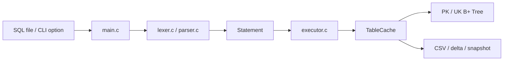

# SQL-B-Tree

C 기반 미니 DB 프로젝트다. CSV 파일을 테이블처럼 사용하며 `INSERT`, `SELECT`, `UPDATE`, `DELETE`를 처리한다.  
이 브랜치는 발표용 서술보다 **현재 코드 구조와 실제 실행 흐름**이 바로 보이도록 README를 다시 정리한 버전이다.

## 현재 코드 기준 핵심 요약

- `PK(id)`와 `UK(email, phone)`는 B+ Tree 인덱스로 처리
- `github` exact-match는 보조 인덱스 경로 지원
- 인덱스가 없는 일반 컬럼은 선형 탐색 유지
- 최대 2,000,000행까지 cache prefix를 메모리에 유지
- 그 이후 row는 uncached tail로 남기고 필요할 때만 CSV 경로로 접근
- `UPDATE` / `DELETE`는 delta log 기반 변경분 기록
- 삭제 후에도 B+ Tree가 stale해지지 않도록 stable slot id 사용
- `CmdProcessor` 기반 worker thread 실행 경로 지원
- 엔진 `SELECT` 응답 body는 binary rowset 형식 지원
- 정글 데이터셋 생성기, 벤치 도구, 점수 계산 도구까지 포함

## 파일 구조

현재 읽기 시작점은 아래 순서가 가장 낫다.

### 1. 진입부

- [main.c](main.c)
  - CLI 옵션 파싱
  - SQL 실행과 데이터 생성 모드 분기
  - SQL 파일 실행 진입점
- [stress_main.c](stress_main.c)
  - 스트레스 테스트 전용 외부 진입점
  - `--benchmark`, `--benchmark-jungle` 실행기
- [bench_memtrack.h](bench_memtrack.h)
  - `BENCH_MEMTRACK` 빌드 시 메모리 추적 후킹
- [sqlsprocessor_bundle.h](sqlsprocessor_bundle.h)
  - IDE에서 `main.c` 하나만 직접 컴파일할 때 구현 파일 결합 담당

### 2. 파싱 계층

- [lexer.c](lexer.c)
- [parser.c](parser.c)
- [parser.h](parser.h)

역할:
- SQL 문자열 -> 토큰
- 토큰 -> `Statement`

### 3. 실행 계층

- [executor.c](executor.c)
- [executor.h](executor.h)

역할:
- `Statement` 실행
- `TableCache` 관리
- CSV / delta / snapshot / index 연동

### 4. 인덱스 계층

- [bptree.c](bptree.c)
- [bptree.h](bptree.h)

역할:
- PK 숫자 B+ Tree
- UK 문자열 B+ Tree
- exact lookup / range lookup

### 5. 벤치/데이터셋 보조

- [jungle_benchmark.c](jungle_benchmark.c)
- [jungle_benchmark.h](jungle_benchmark.h)
- [benchmark_runner.c](benchmark_runner.c)
- [bench_workload_generator.c](bench_workload_generator.c)
- [bench_formula_test.c](bench_formula_test.c)

## 실행 흐름



즉 지금 구조는

1. `main.c`가 입력 방식과 실행 모드를 정리하고
2. `parser`가 SQL을 `Statement`로 바꾸고
3. `executor`가 실제 데이터/인덱스를 건드리는 방식이다.

멀티스레드 API 서버 경로에서는 여기에 `cmd_processor/*` 계층이 앞단에 추가된다.

- frontend가 `CmdRequest`를 생성
- planner가 route/lock plan을 결정
- shard queue에 적재
- worker thread가 parse + executor 실행
- `CmdResponse`를 frontend로 반환

## 빌드

### 기본 빌드

```powershell
gcc -O2 -fdiagnostics-color=always -g main.c -o sqlsprocessor.exe
```

또는:

```bash
make
```

### 메모리 추적 빌드

```powershell
gcc -O2 -fdiagnostics-color=always -g -DBENCH_MEMTRACK main.c -o sqlsprocessor.exe
```

`BENCH_MEMTRACK_REPORT=1` 환경에서 실행하면 requested heap 기준 peak/current 값을 출력한다.

## 기본 사용법

### SQL 파일 실행

```powershell
.\sqlsprocessor.exe demo_bptree.sql
```

### quiet 모드

```powershell
.\sqlsprocessor.exe --quiet demo_bptree.sql
```

### 정글 데이터셋 생성

```powershell
.\sqlsprocessor.exe --generate-jungle 1000000
.\sqlsprocessor.exe --generate-jungle 1000000 my_jungle_demo.csv
```

### 기본 벤치

```powershell
.\stress_runner.exe --benchmark 1000000
```

### SQL 경로 기반 정글 벤치

```powershell
.\stress_runner.exe --benchmark-jungle 1000000
```

## 현재 인덱스 동작

### exact lookup

- `WHERE id = ...` -> PK B+ Tree
- `WHERE email = ...` / `WHERE phone = ...` -> UK B+ Tree

### range lookup

- `WHERE id BETWEEN a AND b` -> PK B+ Tree range scan
- `WHERE email BETWEEN a AND b` -> UK 문자열 B+ Tree range scan

### non-index 조건

- 예: `WHERE name = ...`
- 선형 탐색

즉 발표에서 비교하기 가장 좋은 조합은:

- `id` / `email` / `phone` : 인덱스 경로
- `name` : scan 경로

## 저장 구조

### CSV

기본 테이블 파일.

### delta log

`<table>.delta`

- `UPDATE` / `DELETE` 변경분만 append
- 테이블 reopen 시 replay
- 일정 크기 이상 커지면 compaction

### snapshot

`<table>.idx`

- schema / rows / PK/UK index snapshot
- reopen 시 빠른 복구에 사용

### binary snapshot

`<table>.idxb`

- large table preload 속도를 줄이기 위한 binary snapshot
- mixed TCP benchmark에서 startup 비용 절감에 사용

## 메모리 모델

현재 cache prefix 방식은 아래처럼 동작한다.

- 앞쪽 최대 2,000,000행만 `TableCache`에 캐시
- tail은 CSV에 남김
- PK exact lookup은 tail도 offset 인덱스로 바로 찾음
- non-index 조회는 cache + tail scan

즉 “전체를 무조건 메모리에 올리지 않는다”가 현재 구조의 핵심이다.

## UPDATE / DELETE 현재 구조

현재 코드는 아래 성격으로 정리돼 있다.

- lookup 판단: 공통 mutation lookup plan
- cached row 수정/삭제: slot id 기준 처리
- uncached tail PK row: delta log 기반 처리
- over-limit table 일반 조건: rewrite fallback

즉 단순히 row 배열을 밀어붙이는 구조가 아니라,

- `stable slot id`
- `delta append`
- `tail fallback`

조합으로 유지된다.

## 정글 데이터셋

기본 파일:

- `jungle_benchmark_users.csv`

기본 스키마:

```csv
id(PK),email(UK),phone(UK),name,track(NN),background,history,pretest,github,status,round
```

비교 포인트:

- `id` : PK 인덱스
- `email` : UK 인덱스
- `phone` : UK 인덱스
- `name` : 선형 탐색

## 시나리오와 워크로드

### 시나리오 SQL

- `scenario_jungle_regression.sql`
- `scenario_jungle_range_and_replay.sql`
- `scenario_jungle_update_constraints.sql`

### 생성 워크로드

```bash
make generate-jungle-sql
```

생성 위치:

- `generated_sql/jungle_insert_score.sql`
- `generated_sql/jungle_update_score.sql`
- `generated_sql/jungle_delete_score.sql`
- 기타 smoke / regression / correctness SQL

## 현재 참고 문서

- `docs/STRESS_TESTING_KO.md`
  - 엔진/동시성/외부 TCP mixed CRUD 테스트 방법 정리
- `docs/multithread-optimization-plan.md`
  - DB + worker 최적화와 현재 병목 정리
- `docs/DB_WORKER_CURRENT_STATE_KO.md`
  - 팀 인수인계 기준 현재 상태 요약

## 점수/벤치 도구

### bench-score

```bash
make bench-score
```

현재 Makefile은 `bench_score_exec.conf`를 사용해 실행 파일 스펙을 읽고,  
`benchmark_runner`가 SQL 생성 -> correctness -> `stress_runner` benchmark -> report 생성까지 담당한다.

결과 산출물:

- `artifacts/bench/report.json`
- `artifacts/bench/report.md`

## Make Targets

```bash
make
make demo-bptree
make generate-jungle
make demo-jungle
make scenario-jungle-regression
make scenario-jungle-range-and-replay
make scenario-jungle-update-constraints
make generate-jungle-sql
make benchmark
make benchmark-jungle
make bench-smoke
make bench-score
make bench-report
make bench-clean
```

스트레스 테스트 운영 가이드는 [docs/STRESS_TESTING_KO.md](docs/STRESS_TESTING_KO.md) 에 정리했다.

## 발표 때 설명하기 좋은 포인트

1. `PK/UK는 B+ Tree`, 일반 컬럼은 scan으로 비교 기준 유지
2. 대용량에서는 `cache prefix + uncached tail + tail PK offset`으로 메모리 사용량 제어
3. 쓰기 경로는 `stable slot id + delta log`로 전체 rewrite를 줄임
4. 벤치/점수 도구까지 같이 들어 있어 결과를 반복 재현 가능
