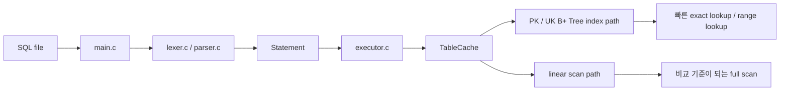
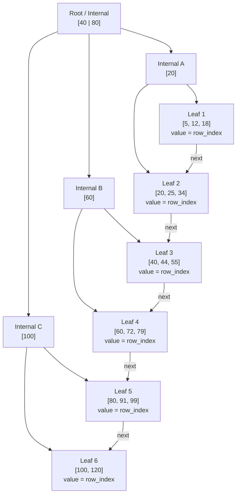

# SQL-B-Tree

B+ Tree 인덱스로 탐색 속도 개선을 수행한 미니 DB 프로젝트임.

이 프로젝트는 CSV 기반의 간단한 SQL 처리기에 `B+ Tree` 인덱스를 적용하여, `WHERE id = ...`, `WHERE email = ...`, `WHERE phone = ...` 같은 조회를 선형 탐색보다 빠르게 처리하는 것을 목표로 한 작업임.

## 프로젝트 개요

- `PK(id)`와 `UK(email, phone)`는 `B+ Tree` 인덱스로 처리함.
- 인덱스가 없는 일반 컬럼은 선형 탐색으로 유지하여, 인덱스 효과 비교를 용이하게 한 구성.

## 시스템 한눈에 보기



이 흐름을 기준으로 보면 프로젝트는 크게 세 층으로 구분 가능함.

- 해석 계층: `lexer.c`, `parser.c`
- 실행 계층: `executor.c`, `TableCache`
- 인덱스 계층: `bptree.c`, `PK/UK B+ Tree`

`SELECT` 실행 시 조건 컬럼에 따라 다른 경로를 선택하는 구조.

- `WHERE id = ...` -> 숫자 B+ Tree
- `WHERE email = ...`, `WHERE phone = ...` -> 문자열 UK B+ Tree
- 그 외 컬럼 -> linear scan

## 테스트 구현

### 1. 레코드 생성기

발표용 데이터셋은 `정글 지원자 100만 건` 시나리오로 구성함. 크래프톤 정글에 100만 명의 지원자가 몰린 상황에서 특정 지원자 정보를 찾아야 하는 상황을 가정한 설정임.

| 항목 | 내용 |
|---|---|
| 상황 | 100만 명의 지원자 중 특정 지원자를 빠르게 찾아야 하는 상황 |
| 기본 스키마 | `id(PK), email(UK), phone(UK), name, track(NN), ...` |

| 비교 컬럼 | 제약 | 탐색 경로 | 발표 포인트 |
|---|---|---|---|
| `id` | `PK` | 인덱스 조회 | PK exact lookup 성능 |
| `email` | `UK` | 인덱스 조회 | 보조 키 exact lookup 성능 |
| `phone` | `UK` | 인덱스 조회 | 보조 키 exact lookup 성능 |
| `name` | - | 선형 탐색 | non-index scan 비교 |

이와 같이 구성하여 인덱스 적용 컬럼과 비적용 컬럼의 차이를 발표에서 즉시 제시할 수 있도록 한 설계.

### 2. malloc-lab 스타일 점수화

평가 철학은 `malloc-lab`에서 영감을 받은 설계임.

| 원칙 | 내용 |
|---|---|
| 정확성 우선 | correctness 실패 시 성능 점수는 무효 |
| 정규화 비교 | 처리량과 메모리 효율을 함께 평가 |
| 가중합 점수 | 읽기 중심 서비스 특성을 반영 |

최종 점수 공식은 아래와 같음.

```text
Score = 100 * (0.60 * throughput + 0.40 * util)
```

throughput 내부 가중치는 다음과 같음.

| 연산 | 가중치 |
|---|---:|
| `SELECT` | 60% |
| `INSERT` | 20% |
| `UPDATE` | 15% |
| `DELETE` | 5% |

그리고 `SELECT` 내부는 다시 다음과 같이 구분함.

| SELECT 세부 항목 | 가중치 |
|---|---:|
| `id exact lookup` | 60% |
| `UK exact lookup` | 30% |
| `scan(name)` | 10% |

## 현재 측정 예시

아래 값은 현재 저장소의 [`artifacts/bench/report.md`](artifacts/bench/report.md), [`artifacts/bench/report.json`](artifacts/bench/report.json) 기준 `smoke` 프로필 측정 예시임.

### 점수 요약

| 항목 | 값 |
|---|---|
| correctness_pass | `true` |
| score_value | `80.245057` |
| delete_mode | `estimated` |
| util_mode | `memtrack` |

`delete_mode = estimated`는 DELETE 경로가 아직 완전히 안정화되기 전이므로 보수적으로 반영하고 있음을 의미함.

### Throughput 예시 표

| metric | value (ops/sec) |
|---|---:|
| id_select | 6993006.99 |
| uk_email_select | 2398081.53 |
| uk_phone_select | 2398081.53 |
| scan_select | 473.26 |
| insert | 18919.81 |
| update | 12793.22 |
| delete | 53198.65 |

- 인덱스가 붙은 exact lookup은 매우 높은 throughput을 보이는 양상.
- `name`처럼 인덱스가 없는 컬럼은 의도적으로 scan path를 타기 때문에 훨씬 느린 결과.
- 즉, B+ Tree 적용 컬럼과 비적용 컬럼의 차이가 결과 수치로 드러나는 구조.

---

## 성능 개선 항목 (Performance Optimization)

### 1. 메모리 점유율 안정화를 위한 부분 캐싱 (Cache Prefix)
* 전체 데이터를 메모리에 상주시키지 않고 상위 2,000,000건의 레코드만 선별적으로 캐싱함.
* 캐시 범위를 초과하는 데이터는 캐시되지 않은('Uncached tail') 영역으로 분류하여 필요 시에만 파일 경로를 통해 접근함.
* 메모리 초과(OOM)를 방지하는 동시에 빈번하게 접근하는 데이터의 응답 속도를 확보함.

### 2. 페이지 캐시 및 레이지 로우(Lazy Row) 로딩
* 데이터 전체 문자열을 항상 유지하지 않고, 실제 요청이 발생하는 시점에 로드하는 지연 로딩 방식을 채택함.
* 페이지 캐시를 통해 파일의 특정 페이지만 선별적으로 읽어 재사용 효율을 극대화함.
* 레코드 오프셋(Offset) 정보를 관리하여 동일 데이터 재조회 시 파일 전체 스캔 과정을 생략함.
* 100만 행에서 `name` 선형 스캔을 20번 반복했을 때, page cache가 없을 때보다 총 스캔 시간 약 12.6% 단축 확인함.
* row 문자열을 전부 상주시키지 않고 offset 기반으로 필요한 row만 읽되, 반복 스캔 시 같은 CSV page를 재사용하여 `seek + fgets` 비용을 줄인 결과.

### 3. 미캐싱 영역 대상 PK 오프셋 관리
* 캐시되지 않은 데이터('Uncached tail')에 대해서도 PK(Primary Key) 기반의 위치 정보를 별도로 기억함.
* 데이터 본문이 메모리에 없더라도 `WHERE id = ...`와 같은 단일 조회 시 즉각적인 파일 탐색(O(logN))이 가능하도록 설계함.
* 메모리 제약 조건 속에서도 핵심 인덱스 조회 성능을 최대한 보존함.
* 210만 행 테이블에서 메모리 밖 tail 10만 행을 PK로 300번 조회했을 때, tail PK offset이 없을 때보다 전체 실행 시간 약 3.36배 향상, 70.2% 단축 확인함.
* tail 구간 전체를 다시 스캔하지 않고 `PK -> file offset`을 바로 찾아 direct seek 하는 방식으로, 메모리 밖 데이터에서도 exact lookup 지연을 크게 줄인 결과.

### 4. 데이터 규모에 따른 적응형(Adaptive) 차수 적용
* 데이터셋 규모에 따라 B+ Tree의 차수(Order)를 8에서 64까지 유동적으로 조절함.
* 데이터 크기에 최적화된 Fan-out을 선택하여 트리 높이를 낮추고 노드 분할에 따른 연산 비용을 최적화함.
* 100만 행 기준으로 PK 조회는 약 30.5%, UK 조회는 약 16.9% 더 빨라진 결과 확인함.
* 노드 내부 비교를 이진 탐색으로 줄이고, 대규모 데이터에서 더 큰 차수를 선택해 조회 시 비교 횟수와 하향 탐색 비용을 감소시킨 결과.

### 5. 변경분만 기록하는 델타 로그와 슬롯 재사용
* 데이터 수정/삭제 시 원본 CSV 전체를 재작성하지 않고 변경 사항만 기록하는 델타 로그 구조를 도입함.
* 메모리 내 슬롯 ID를 안정적으로 유지하고 삭제된 슬롯을 효율적으로 재사용함.
* 쓰기 경로에서의 오버헤드를 줄이고 인덱스와 물리적 위치 간의 정합성을 안정적으로 유지함.
* 100만 행 테이블에서 PK 기준 UPDATE 20회는 약 8.2배, DELETE 20회는 약 14.1배 더 빨라진 결과 확인함.
* 변경분만 delta 파일에 추가하고 slot_id를 유지해, 수정/삭제 시 전체 CSV 재작성과 대규모 인덱스 재구성을 피한 결과.

## 회고

### 좋았던 점

- 성능 및 기능 측면에서 다양한 개선을 이뤄낸 점.
- `데이터셋 생성기 -> 워크로드 생성기 -> correctness gate -> 점수화 -> report`까지 이어지는 평가 흐름을 구축한 점.

### 아쉬웠던 점

- 팀을 두 그룹으로 나누어 진행했지만, 기대한 수준의 긴밀한 협업에는 이르지 못한 점.
- 전체적으로 시작이 늦어 구현과 정리 모두 촉박했던 점.
- 시각화에도 도전했지만 끝까지 만족스럽게 마무리하지 못한 점.
- 코드 레벨 이해가 충분하지 못하여 구현 디테일을 더 깊게 설명하지 못한 부분이 남은 점.

### 새로운 시도

- 4명의 팀을 다시 2명의 팀 단위로 나누어 진행해 봄.
- 발표 문서에 Mermaid 다이어그램과 의사코드를 함께 넣어서 코드 전체를 읽지 않아도 구조를 이해할 수 있게 하려 함.

## 부록
### B+ Tree

#### 왜 B+ Tree를 썼는가

- 정확히 하나를 찾는 경우와 특정 범위의 값을 찾는 경우를 모두 다루기 쉬운 자료구조이기 때문.

#### 핵심 구조

- `internal node`: 경계값을 보고 어느 child로 내려갈지 결정
- `leaf node`: 실제 `key -> row_index`를 저장
- `next pointer`: leaf끼리를 연결해 range scan을 쉽게 만듦



#### 의사코드

검색은 root에서 leaf까지 내려가고, leaf에서 실제 row 위치를 찾아 종료되는 과정.

```text
search(key):
    node = root

    while node is internal:
        key가 속한 범위를 비교해 child를 고른다
        node = selected child

    leaf에서 key를 찾는다
    return row_index
```

삽입은 leaf에 정렬 위치로 들어가고, overflow 발생 시 split이 상위로 전파되는 구조.

```text
insert(key, row_index):
    leaf까지 내려간다
    정렬 위치에 삽입한다

    if leaf overflow:
        split
        오른쪽 leaf의 첫 key를 부모에 올린다

    if parent overflow:
        split을 위로 전파한다

    if root overflow:
        새 root를 만든다
```

대량 로드 시에는 한 건씩 insert하지 않고 bulk-build를 사용하는 방식.

```text
bulk_build(sorted_pairs):
    leaf level을 먼저 만든다
    leaf끼리 next로 연결한다
    위 레벨 internal node를 아래에서 위로 쌓는다
```

### 빌드

```powershell
gcc -O2 main.c -o sqlsprocessor.exe
```

또는 `make`가 있는 환경에서는 아래 명령 사용 가능함.

```bash
make
```

### 기본 데모

```powershell
.\sqlsprocessor.exe demo_bptree.sql
.\sqlsprocessor.exe demo_jungle.sql
```

또는

```bash
make demo-bptree
make demo-jungle
```

### 데이터셋 생성

```powershell
.\sqlsprocessor.exe --generate-jungle 1000000
```

또는

```bash
make generate-jungle
```

### SQL 워크로드 생성

```bash
python scripts/generate_jungle_sql_workloads.py
make generate-jungle-sql
```

### 벤치마크

```powershell
.\sqlsprocessor.exe --benchmark 1000000
.\sqlsprocessor.exe --benchmark-jungle 1000000
```

또는

```bash
make benchmark
make benchmark-jungle
make bench-smoke
make bench-score
make bench-report
```

### 시나리오 테스트

```bash
make scenario-jungle-regression
make scenario-jungle-range-and-replay
make scenario-jungle-update-constraints
```

### 참고 문서

- [구조 의사코드](docs/ARCHITECTURE_PSEUDOCODE_KO.md)
- [B+ Tree / 시스템 다이어그램 초안](docs/FIGJAM_DIAGRAM_DRAFTS_KO.md)
- [벤치마크 개발 계획](docs/BENCHMARK_DEVELOPMENT_PLAN_KO.md)
- [평가기 설명서](docs/EVALUATOR_EXPLAINER_KO.md)
- [정글 지원자 데이터셋 설계](docs/JUNGLE_DATASET_DESIGN_KO.md)
