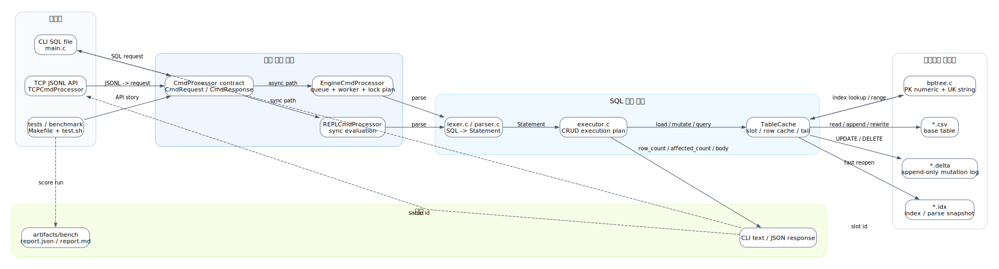

# 미니 DBMS - API 서버

이 프로젝트는 **C로 구현한 미니 DBMS - API 서버**다. 외부 클라이언트가 TCP socket으로 JSONL 요청을 보내면, 서버는 요청을 `CmdRequest`로 바꾸고 내부 SQL 처리기와 B+ Tree 인덱스를 통해 DBMS 기능을 실행한다.

핵심은 단순히 "API 서버를 붙였다"가 아니다. **동시에 들어온 SQL 요청을 API 계층과 DB 계층이 각각 어떤 책임으로 처리했는지**이다.

```text
API 계층: 연결, JSONL 파싱, in-flight 추적, request id 기반 응답 매칭
DB 계층 : queue/worker, request plan, lock plan, executor/TableCache 보호
```

## 1. 개요

### 전체 구조



DOT 원본: [readme_project_overall_flow.dot](docs/sijun-yang/diagrams/readme_project_overall_flow.dot)

1. 프로젝트의 진입점은 CLI SQL file, TCP JSONL API, 테스트/벤치마크로 나뉜다.
2. 각 진입점은 입력 형식만 다를 뿐, 공통 요청 객체인 `CmdRequest`로 요청을 넘긴다.
3. `CmdProcessor` 계약은 요청 제출, 응답 callback, request/response 소유권 규칙을 통일한다.
4. 운영 흐름에서는 `EngineCmdProcessor`가 queue, worker, lock plan으로 DB 실행 순서를 조정한다.
5. SQL 실행 계층은 `lexer/parser/executor`, `TableCache`, B+ Tree 인덱스, CSV/delta/idx 저장 구조를 사용한다.
6. 결과는 호출 방식에 맞춰 CLI text, TCP JSON response, benchmark report로 반환된다.


## 2. API

핵심은 TCP 서버가 DB 자체가 아니라, 외부 요청을 공통 요청 객체로 바꿔 내부 처리 계층에 넘기는 어댑터라는 점이다.

### API 서버 아키텍처


DOT 원본: [004_tcp_cmd_processor_architecture_flow.dot](docs/sijun-yang/diagrams/004_tcp_cmd_processor_architecture_flow.dot)

API 서버가 담당하는 일은 네 가지다.

| 책임 | 설명 |
| --- | --- |
| connection 관리 | listen socket, client socket, connection list, client별 제한 |
| request parsing | JSONL 한 줄을 읽고 `id`, `op`, `sql` 필드 검증 |
| in-flight 추적 | 아직 응답이 오지 않은 request id를 connection별로 관리 |
| response 직렬화 | `CmdResponse`를 JSON 한 줄로 바꿔 같은 connection에 write |

### JSONL 프로토콜

요청은 newline으로 구분되는 JSON object 한 줄이다.

```json
{"id":"s1","op":"sql","sql":"SELECT * FROM users WHERE id = 1;"}
{"id":"p1","op":"ping"}
{"id":"c1","op":"close"}
```

응답은 항상 request id를 포함한다.

```json
{"id":"p1","ok":true,"status":"OK","body":"pong"}
{"id":"s1","ok":true,"status":"OK","row_count":1,"body":"SELECT matched_rows=1"}
{"id":"bad","ok":false,"status":"BAD_REQUEST","error":"missing sql"}
```

### CmdProcessor 공통 계약

`CmdProcessor`는 TCP, CLI, REPL, 테스트 코드가 SQL 처리 로직에 직접 의존하지 않도록 하는 공통 인터페이스다.


DOT 원본: [004_cmd_processor_overall_architecture.dot](docs/sijun-yang/diagrams/004_cmd_processor_overall_architecture.dot)

| 구성 | 책임 |
| --- | --- |
| `CmdRequest` | 요청 id, 요청 타입, SQL 문자열 |
| `CmdResponse` | status, ok 여부, row/affected count, body/error |
| `CmdProcessor` | request 확보, submit, callback, release 규칙 |
| `EngineCmdProcessor` | queue/worker/lock plan 기반 운영용 처리 |
| `REPLCmdProcessor` | 동기 실행 흐름 |
| `MockCmdProcessor` | 계약 자체를 검증하는 테스트 구현체 |

`submit`의 반환값은 SQL 실행 성공이 아니라 **요청 제출 성공**을 의미한다. 실제 SQL 결과는 비동기로 돌아오는 `CmdResponse` callback에 담긴다.

### API 계층의 동시성

같은 connection 안에서도 여러 요청이 in-flight 상태가 될 수 있다.


DOT 원본: [004_tcp_multi_request_inflight_flow.dot](docs/sijun-yang/diagrams/004_tcp_multi_request_inflight_flow.dot)

| 이슈 | API 계층 처리 방식 |
| --- | --- |
| 응답 순서 역전 | response의 `id`로 요청과 응답을 매칭 |
| 중복 request id | 같은 connection의 in-flight 목록에 이미 있으면 `BAD_REQUEST` |
| connection 과다 | 전체 connection 수와 client별 connection 수 제한 |
| in-flight 과다 | connection별/client별 in-flight 수 제한 후 `BUSY` 응답 |
| callback 응답 | worker가 만든 `CmdResponse`를 같은 connection에 JSONL로 write |

중요한 경계가 있다. API 계층은 **요청을 동시에 받고 추적하는 계층**이다. SQL 실행 순서, DB lock, `TableCache` 보호는 API 계층이 직접 처리하지 않고 `EngineCmdProcessor`가 담당한다.

## 3. DB

DB 장의 핵심은 기존 SQL 처리기와 B+ Tree를 재사용하면서도, 동시에 들어온 SQL 요청이 DB 상태를 깨뜨리지 않도록 보수적인 실행 경계를 만든 점이다.

### CmdProcessor와 DB 실행 경계


DOT 원본: [004_cmd_processor_benefit_db_boundary.dot](docs/sijun-yang/diagrams/004_cmd_processor_benefit_db_boundary.dot)

이 그림은 API 장의 `CmdProcessor` 설명과 DB 장의 동시성 설명 사이를 잇는다. `CmdProcessor` 구현체는 request plan, queue/worker, lock plan, engine guard까지 맡고, DB 실행 계층은 SQL 파싱, executor, `TableCache`, B+ Tree, 저장 파일을 맡는다.

### DB단 동시성 처리

API 동시성 설명만으로는 부족하다. 이 프로젝트의 중점은 API로 동시에 들어온 SQL 요청이 DB 엔진 안에서 어떻게 처리되는지다.


DOT 원본: [readme_db_concurrency_flow.dot](docs/sijun-yang/diagrams/readme_db_concurrency_flow.dot)

`EngineCmdProcessor`는 요청을 단순히 worker에게 던지는 것이 아니라, 먼저 실행 계획을 얕게 만든다.

| 단계 | 처리 내용 |
| --- | --- |
| request plan | SQL 앞부분을 보고 `SELECT=READ`, `INSERT/UPDATE/DELETE=WRITE`로 분류 |
| route plan | table name을 hash해 target shard queue 선택 |
| lock plan | table 단위로 READ lock 또는 WRITE lock 대상 생성 |
| queue/worker | worker thread가 queue에서 job을 꺼내 처리 |
| lock acquire | `LockManager`가 table 이름 기준 bucket의 rwlock 획득 |
| engine guard | `parser/executor/TableCache` 실행 구간을 `engine_mutex`로 보호 |
| callback | 실행 결과를 `CmdResponse`로 만들어 API 계층에 반환 |

발표에서 과장하면 안 되는 지점도 있다. 현재 executor와 `TableCache`는 `open_tables` 같은 전역 상태를 공유한다. 그래서 table 단위 read/write lock plan을 만들더라도, 실제 parse/execute 구간은 `engine_mutex`로 한 번 더 감싸 보수적으로 보호한다.

발표 문장은 이렇게 잡는다.

```text
API 요청은 병렬로 접수되고 queue에 쌓인다.
DB 처리 계층은 SQL을 READ/WRITE로 분류하고 table 단위 lock plan을 만든다.
다만 현재 executor/TableCache는 전역 상태를 공유하므로,
실제 실행 구간은 global engine mutex로 보호해 일관성을 우선했다.
```

발표에서 가장 중요한 비교는 이것이다.

```text
id / email / phone -> 인덱스 경로
name / status / 기타 일반 컬럼 -> 스캔 경로
```

B+ Tree는 `key -> slot id`를 찾는다. 실제 row 문자열은 `TableCache`의 slot, CSV offset, 또는 tail overlay에서 읽는다. 즉 B+ Tree는 데이터를 통째로 들고 있는 저장소가 아니라 **row 위치를 빠르게 찾는 지도**다.

### TableCache와 저장 구조

저장소는 세 파일로 나뉜다.

| 파일 | 역할 |
| --- | --- |
| `table.csv` | 기본 테이블 데이터 |
| `table.delta` | `UPDATE` / `DELETE` 변경분을 append-only로 기록 |
| `table.idx` | CSV parse 결과와 B+ Tree 인덱스 스냅샷 |

`TableCache`는 이 세 파일을 한 번에 묶어서 관리한다.

```text
TableCache
    columns / constraints
    active slot list
    row cache
    PK B+ Tree
    UK B+ Trees
    CSV row offsets
    uncached tail index
    delta overlay
```

| 구간 | 처리 방식 |
| --- | --- |
| cache prefix | 최대 `MAX_RECORDS` 2,000,000개 slot을 기준으로 인덱스와 row 참조 유지 |
| uncached tail | 그 이후 row는 CSV에 남기고, PK exact lookup은 tail offset index로 접근 |

### 쓰기와 recovery

쓰기 계층의 목표는 인덱스와 저장소가 서로 어긋나지 않게 하는 것이다.

| 작업 | 핵심 흐름 |
| --- | --- |
| `INSERT` | row 생성 -> PK/UK/NN 검사 -> CSV append -> B+ Tree 갱신 |
| `UPDATE` | 대상 row 찾기 -> PK 변경 방지 -> UK 중복 검사 -> row 교체 -> delta append |
| `DELETE` | 대상 row 찾기 -> active flag 해제 -> 인덱스/slot 정리 -> delta append |
| fallback | delta를 쓸 수 없거나 tail 조건이 복잡하면 CSV rewrite |
| reopen | 가능한 경우 `.idx` snapshot 로드 후 `.delta` replay |

삭제 후에도 인덱스가 stale row를 가리키지 않도록 slot 활성 상태와 free slot 목록을 따로 관리한다. tail row의 `UPDATE` / `DELETE`는 CSV 원본을 바로 덮어쓰지 않고 delta overlay로 반영한다.

## 4. 성능

이 장의 수치와 그래프는 추후 추가한다. README에는 발표자가 성능 장을 채우기 쉽도록 어떤 지표를 연결하면 좋은지만 미리 잡아둔다.

| 관점 | 추천 지표 | 연결되는 구현 |
| --- | --- | --- |
| API 병렬성 | `peak_request_slots`, `max_queue_depth` | in-flight 요청과 Engine queue 사용량 |
| DB 대기 시간 | `avg_queue_wait_us`, `avg_lock_wait_us`, `avg_exec_us` | queue 대기, lock 대기, 실제 SQL 실행 시간 |
| 인덱스 효과 | B+ Tree 조회 vs scan 조회 | `id/email/phone` 인덱스 경로와 `name/status` scan 경로 비교 |
| 부하 시연 | `./test.sh --stress` 처리량 | 키오스크 4대, connection당 window 16개 요청 |

발표용 검증 흐름은 아래 순서가 자연스럽다.

```bash
./test.sh
./test.sh --stress
make test-cmd-processor-scale-score
```

`./test.sh`는 API 기능과 엣지 케이스를 보여주고, `./test.sh --stress`는 여러 클라이언트가 outstanding 요청을 유지하는 장면을 보여준다. `make test-cmd-processor-scale-score`는 queue wait, lock wait, exec time을 숫자로 확인하는 용도다.

## 5. 협업방식

이 장의 상세 내용은 추후 추가한다. 다만 과제 목적에 맞춰 발표에서 반드시 이어야 할 메시지는 아래와 같다.

| 관점 | 발표 메시지 |
| --- | --- |
| AI 활용 | 하루 안에 낯선 API 서버와 thread pool 구조를 Top-down으로 빠르게 구현하기 위해 AI를 적극 활용 |
| 소화한 핵심 로직 | `CmdProcessor`, thread pool, request plan, lock plan, B+ Tree 조회 경로를 설명 가능하게 정리 |
| 역할 분담 | API, DB 엔진, 테스트/벤치, 문서/발표로 나눠 진행 |
| 완성도 | 요구사항, 테스트, 엣지 케이스, 성능 지표 후보를 README에서 한 흐름으로 제시 |

발표에서는 "AI가 코드를 대신 썼다"가 아니라, **AI를 활용해 구현 속도를 높이고, 핵심 동작 원리를 설명할 수 있게 소화했다**는 방향으로 말한다.

## 부록 A. 빌드와 실행

기본 빌드:

```bash
make
```

SQL 파일 실행:

```bash
./sqlsprocessor demo_bptree.sql
./sqlsprocessor --quiet demo_bptree.sql
```

정글 데이터셋 생성:

```bash
./sqlsprocessor --generate-jungle 1000000
./sqlsprocessor --generate-jungle 1000000 my_jungle_demo.csv
```

기본 벤치:

```bash
./sqlsprocessor --benchmark 1000000
./sqlsprocessor --benchmark-jungle 1000000
```

테스트:

```bash
make test-cmd-processor
make test-repl-cmd-processor
make test-tcp-cmd-processor
make test-cmd-processor-scale-score
```

발표용 API story test:

```bash
./test.sh
./test.sh --stress
```

점수형 벤치:

```bash
make bench-smoke
make bench-score
make bench-report
```

## 부록 B. 파일 구조

| 위치 | 역할 |
| --- | --- |
| `main.c` | CLI 옵션, SQL 파일 읽기, EngineCmdProcessor 초기화 |
| `lexer.c`, `parser.c` | SQL text를 `Statement`로 변환 |
| `executor.c`, `executor.h` | CRUD 실행, TableCache, CSV/delta/snapshot/index 연동 |
| `bptree.c`, `bptree.h` | 숫자 PK B+ Tree, 문자열 UK B+ Tree |
| `types.h` | `Statement`, `TableCache`, token, column metadata |
| `cmd_processor/` | 공통 요청 처리 계약, Engine/REPL/TCP/Mock 구현 |
| `thirdparty/cjson/` | TCP JSON request/response 처리 |
| `benchmark_runner.c` | correctness/benchmark/report 실행기 |
| `bench_workload_generator.c` | 벤치 SQL workload 생성 |
| `tests/api_story_test.c` | 발표용 TCP API story test runner |
| `docs/sijun-yang/004_cmd_processor_architecture_flow.md` | CmdProcessor/TCP 상세 발표 문서 |

## 부록 C. 발표 후 Q&A 대비

| 질문 | 답 |
| --- | --- |
| API 서버는 실제로 외부 접속을 받나? | `TCPCmdProcessor`가 TCP listen socket을 열고, 테스트 러너가 별도 client socket으로 JSONL 요청을 보낸다. |
| API 동시성과 DB 동시성은 무엇이 다른가? | API는 요청 접수/추적/응답 매칭을 담당하고, DB는 queue/worker/lock plan/engine mutex로 실행 일관성을 담당한다. |
| 스레드풀은 어디에 있나? | `EngineCmdProcessor`가 queue와 worker thread를 만들고, TCP connection thread는 SQL을 직접 실행하지 않고 submit만 한다. |
| DB 요청은 완전히 병렬 실행되나? | 요청 접수와 큐잉은 병렬이지만, 현재 executor/TableCache 실행 구간은 전역 상태 보호를 위해 `engine_mutex`로 보수적으로 보호한다. |
| 동시 요청의 응답 순서가 바뀌면? | response의 `id`가 요청 id와 같기 때문에 클라이언트가 id로 매칭한다. |
| 잘못된 API 요청은 어떻게 되나? | malformed JSON, 필수 필드 누락, SQL 길이 초과, 중복 in-flight id는 DB 실행 전에 실패 응답으로 정리한다. |
| 왜 B+ Tree인가? | exact lookup뿐 아니라 `BETWEEN` range scan을 같은 인덱스로 설명할 수 있기 때문이다. |
| 왜 모든 컬럼을 인덱싱하지 않았나? | 인덱스 경로와 scan 경로의 차이를 보여주고, 메모리/갱신 비용을 통제하기 위해 PK/UK 중심으로 제한했다. |
| CSV인데 DBMS라고 할 수 있나? | 저장 포맷은 CSV지만 SQL parser, executor, index, mutation log, request processor를 갖춘 작은 DBMS 구조다. |
| 재실행하면 인덱스를 다시 다 만드나? | 가능한 경우 `*.idx` snapshot을 읽고, 변경분은 `*.delta`를 replay한다. |
