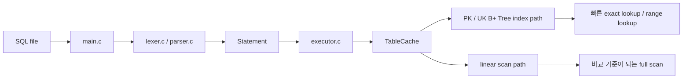
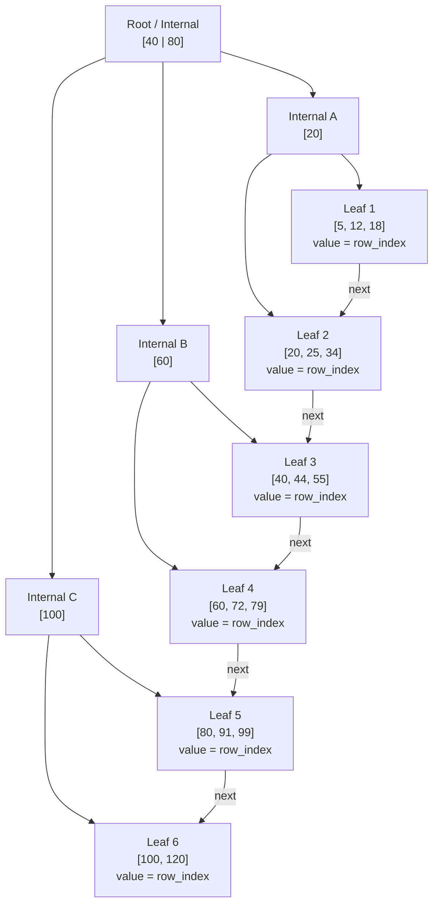

# SQL-B-Tree

B+ Tree 인덱스로 탐색 속도를 개선한 미니 DB 프로젝트입니다.

이 프로젝트는 CSV 기반의 간단한 SQL 처리기에 `B+ Tree` 인덱스를 붙여, `WHERE id = ...`, `WHERE email = ...`, `WHERE phone = ...` 같은 조회를 선형 탐색보다 빠르게 처리하는 것을 목표로 했습니다.

## 프로젝트 개요

- `PK(id)`와 `UK(email, phone)`는 `B+ Tree` 인덱스로 처리합니다.
- 인덱스가 없는 일반 컬럼은 선형 탐색으로 남겨 두어, 인덱스의 효과를 비교하기 쉽게 만들었습니다.

## 시스템 한눈에 보기



이 흐름을 기준으로 보면 프로젝트는 크게 세 층으로 볼 수 있습니다.

- 해석 계층: `lexer.c`, `parser.c`
- 실행 계층: `executor.c`, `TableCache`
- 인덱스 계층: `bptree.c`, `PK/UK B+ Tree`

`SELECT`를 실행할 때 조건 컬럼에 따라 다른 경로를 택하게 됩니다.

- `WHERE id = ...` -> 숫자 B+ Tree
- `WHERE email = ...`, `WHERE phone = ...` -> 문자열 UK B+ Tree
- 그 외 컬럼 -> linear scan

## 테스트 구현

### 1. 레코드 생성기

발표용 데이터셋은 `정글 지원자 100만 건` 시나리오로 만들었습니다. 크래프톤 정글이 너무나 유명해진 나머지, 100만 명의 지원자가 몰린 상황에서 특정 지원자의 정보를 찾아야 하는 상황입니다.

- 기본 스키마: `id(PK), email(UK), phone(UK), name, track(NN), ...`
- 비교 대상:
  - `id`, `email`, `phone` -> 인덱스 경로
  - `name` -> 선형 탐색 경로

이렇게 구성해서 인덱스가 붙은 컬럼과 붙지 않은 컬럼의 차이를 발표에서 바로 보여줄 수 있게 했습니다.

### 2. malloc-lab 스타일 점수화

평가 철학은 `malloc-lab`에서 영감을 받았습니다.

- 정확성 우선: correctness 실패 시 성능 점수는 무효
- 정규화 비교: 처리량과 메모리 효율을 함께 본다
- 가중합 점수: 읽기 중심 서비스 특성을 반영한다

최종 점수 공식은 아래와 같습니다.

```text
Score = 100 * (0.60 * throughput + 0.40 * util)
```

throughput 내부 가중치는 다음과 같습니다.

- `SELECT`: 60%
- `INSERT`: 20%
- `UPDATE`: 15%
- `DELETE`: 5%

그리고 `SELECT` 내부에서는 다시 다음과 같이 나눕니다.

- `id exact lookup`: 60%
- `UK exact lookup`: 30%
- `scan(name)`: 10%

## 현재 측정 예시

아래 값은 현재 저장소의 [`artifacts/bench/report.md`](artifacts/bench/report.md), [`artifacts/bench/report.json`](artifacts/bench/report.json) 기준 `smoke` 프로필 측정 예시입니다.

### 점수 요약

| 항목 | 값 |
|---|---|
| correctness_pass | `true` |
| score_value | `80.245057` |
| delete_mode | `estimated` |
| util_mode | `memtrack` |

`delete_mode = estimated`는 DELETE 경로가 아직 완전히 안정화되기 전이라 보수적으로 반영하고 있다는 뜻입니다.

### Throughput 예시 표

| metric | value (ops/sec) |
|---|---:|
| id_select | 6993006.99 |
| uk_email_select | 2398081.53 |
| uk_phone_select | 2398081.53 |
| scan_select | 473.26 |
| insert | 18919.81 |
| update | 12793.22 |
| delete | 53198.65 |

- 인덱스가 붙은 exact lookup은 매우 높은 throughput을 보입니다.
- `name`처럼 인덱스가 없는 컬럼은 의도적으로 scan path를 타기 때문에 훨씬 느립니다.
- 즉, B+ Tree를 붙인 컬럼과 그렇지 않은 컬럼의 차이가 결과 수치로 드러납니다.

## 성능 개선

이번 프로젝트에서 강조할 수 있는 성능 개선 포인트는 아래와 같습니다.

### 1. 캐시 prefix만 메모리에 유지

- 전체 CSV를 무제한으로 메모리에 올리지 않고, 앞부분 최대 `2,000,000`건만 캐시에 유지합니다.
- 캐시 범위를 넘어가는 row는 `uncached tail`로 두고 필요할 때만 파일 경로를 사용합니다.
- 이렇게 해서 메모리 폭주를 막으면서도, 자주 접근하는 구간은 빠르게 처리할 수 있습니다.

### 2. 필요한 페이지만 읽는 page cache + lazy row cache

- row 문자열 전체를 항상 메모리에 두지 않고, 필요한 시점에만 가져옵니다.
- `page cache`는 파일의 일부 페이지만 읽어 재사용합니다.
- `row offset`을 기억해 두어 같은 row를 다시 찾을 때 파일을 처음부터 스캔하지 않습니다.

### 3. uncached tail PK offset 캐시

- 캐시 밖 row 전체를 메모리에 올리지는 않지만, PK 기준 위치 정보는 따로 기억합니다.
- 그래서 `WHERE id = ...` exact lookup은 캐시 밖 데이터도 비교적 빠르게 찾아갈 수 있습니다.
- 즉, 메모리 한계를 지키면서도 PK 조회 성능을 최대한 보존하려는 전략입니다.

### 4. adaptive 차수

`bptree.c`에서는 데이터 규모에 따라 B+ Tree 차수를 자동으로 바꿉니다.

- 작은 데이터셋: `8`
- 중간 데이터셋: `16`
- 더 큰 데이터셋: `32`
- 대형 데이터셋: `64`

이렇게 해서 데이터 크기에 맞는 fan-out을 선택하고, 트리 높이와 노드 분할 비용 사이의 균형을 맞추도록 했습니다.

### 5. append-only delta log와 stable slot ID

- cached table의 `UPDATE`, `DELETE`는 항상 전체 CSV를 다시 쓰지 않도록 `delta log`를 둡니다.
- 메모리에서는 `slot_id`를 안정적으로 유지하고, 삭제된 슬롯은 재사용합니다.
- 이 구조 덕분에 쓰기 경로에서 불필요한 전체 재구성을 줄이고, 인덱스와 row 위치를 더 안정적으로 유지할 수 있었습니다.

## 회고

### 좋았던 점

- 성능 및 기능적인 개선을 많이 이뤄내었습니다.
- `데이터셋 생성기 -> 워크로드 생성기 -> correctness gate -> 점수화 -> report`까지 이어지는 평가 흐름을 갖췄습니다.

### 아쉬웠던 점

- 팀을 두 그룹으로 나눠 진행해 봤지만, 생각했던 만큼 긴밀하게 협업하지는 못했습니다.
- 전체적으로 시작이 늦어서 구현과 정리 모두 촉박했습니다.
- 시각화도 도전했지만 끝까지 만족스럽게 마무리하지 못한 점이 아쉬웠습니다.
- 코드 레벨 이해가 충분하지 못해서, 구현 디테일을 더 깊게 설명하지 못한 부분이 남았습니다.

### 새로운 시도

- 4명의 팀에서 또다시 2명의 팀으로 나누어 진행해 보았습니다.
- 발표 문서에 Mermaid 다이어그램과 의사코드를 함께 넣어, 코드 전체를 읽지 않아도 구조를 이해할 수 있게 노력했습니다.

## 부록
### B+ Tree

#### 왜 B+ Tree를 썼는가

- 정확히 하나를 찾는 경우와 특정 범위의 값을 찾는 경우를 모두 다루기 쉽습니다.

#### 핵심 구조

- `internal node`: 경계값을 보고 어느 child로 내려갈지 결정
- `leaf node`: 실제 `key -> row_index`를 저장
- `next pointer`: leaf끼리를 연결해 range scan을 쉽게 만듦



#### 의사코드

검색은 root에서 leaf까지 내려가고, leaf에서 실제 row 위치를 찾아 끝납니다.

```text
search(key):
    node = root

    while node is internal:
        key가 속한 범위를 비교해 child를 고른다
        node = selected child

    leaf에서 key를 찾는다
    return row_index
```

삽입은 leaf에 정렬 위치로 들어가고, overflow가 나면 split이 위로 전파됩니다.

```text
insert(key, row_index):
    leaf까지 내려간다
    정렬 위치에 삽입한다

    if leaf overflow:
        split
        오른쪽 leaf의 첫 key를 부모에 올린다

    if parent overflow:
        split을 위로 전파한다

    if root overflow:
        새 root를 만든다
```

대량 로드 시에는 한 건씩 insert하지 않고 bulk-build를 사용합니다.

```text
bulk_build(sorted_pairs):
    leaf level을 먼저 만든다
    leaf끼리 next로 연결한다
    위 레벨 internal node를 아래에서 위로 쌓는다
```

### 빌드

```powershell
gcc -O2 main.c -o sqlsprocessor.exe
```

또는 `make`가 있는 환경에서는 아래를 사용할 수 있습니다.

```bash
make
```

### 기본 데모

```powershell
.\sqlsprocessor.exe demo_bptree.sql
.\sqlsprocessor.exe demo_jungle.sql
```

또는

```bash
make demo-bptree
make demo-jungle
```

### 데이터셋 생성

```powershell
.\sqlsprocessor.exe --generate-jungle 1000000
```

또는

```bash
make generate-jungle
```

### SQL 워크로드 생성

```bash
python scripts/generate_jungle_sql_workloads.py
make generate-jungle-sql
```

### 벤치마크

```powershell
.\sqlsprocessor.exe --benchmark 1000000
.\sqlsprocessor.exe --benchmark-jungle 1000000
```

또는

```bash
make benchmark
make benchmark-jungle
make bench-smoke
make bench-score
make bench-report
```

### 시나리오 테스트

```bash
make scenario-jungle-regression
make scenario-jungle-range-and-replay
make scenario-jungle-update-constraints
```

### 참고 문서

- [구조 의사코드](docs/ARCHITECTURE_PSEUDOCODE_KO.md)
- [B+ Tree / 시스템 다이어그램 초안](docs/FIGJAM_DIAGRAM_DRAFTS_KO.md)
- [벤치마크 개발 계획](docs/BENCHMARK_DEVELOPMENT_PLAN_KO.md)
- [평가기 설명서](docs/EVALUATOR_EXPLAINER_KO.md)
- [정글 지원자 데이터셋 설계](docs/JUNGLE_DATASET_DESIGN_KO.md)
