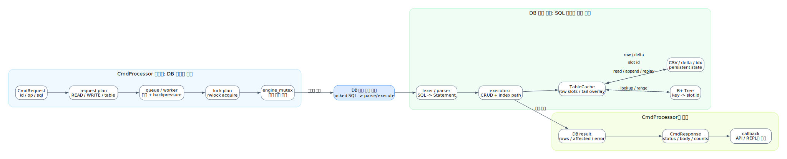
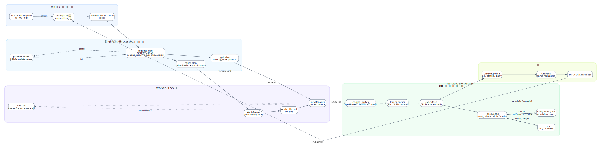

# 미니 DBMS - API 서버

이 프로젝트는 **C로 구현한 미니 DBMS - API 서버**다. 외부 클라이언트가 TCP socket으로 JSONL 요청을 보내면, 서버는 그 요청을 내부 DB 엔진으로 전달하고 기존 SQL 처리기와 B+ Tree 인덱스로 결과를 만든다.

## 1. 개요

이 프로젝트는 C 기반 미니 DBMS에 TCP API 서버를 붙인 결과물이다.

### 전체 구조


- C 언어로 미니 DBMS API 서버를 구현했다.
- 외부 클라이언트는 TCP connection으로 JSONL 요청을 보내 DBMS 기능을 사용할 수 있다.
- 요청은 Thread Pool 흐름으로 처리되어 여러 클라이언트 요청을 동시에 받을 수 있다.
- 내부 DB 엔진은 이전 차수에서 구현한 SQL 처리기와 B+ Tree 인덱스를 재사용한다.
- 테스트와 부하 시연으로 기능, 엣지 케이스, 동시 요청 흐름을 확인한다.

**중점은 API 서버 자체보다, 동시에 들어온 SQL 요청을 어디서 어떻게 통제했는가다.**

## 2. API

API 장에서 말할 것은 하나다. TCP 서버는 DB가 아니라, 외부 요청을 안전하게 받아 DB 처리 계층으로 넘기는 입구에 가깝다.

### API 서버 아키텍처


DOT 원본: [004_tcp_cmd_processor_architecture_flow.dot](docs/sijun-yang/diagrams/004_tcp_cmd_processor_architecture_flow.dot)

- 외부 클라이언트는 TCP connection을 열고 JSONL 한 줄로 SQL 요청을 보낸다.
- 요청 id는 응답이 돌아오기 전까지 in-flight 상태로 추적한다.
- SQL은 API 계층에서 직접 실행하지 않고 DB 처리 계층으로 넘긴다.
- 결과가 돌아오면 같은 request id를 붙여 같은 connection에 응답한다.
- 그래서 응답 순서가 바뀌어도 클라이언트는 id로 자기 요청의 결과를 찾을 수 있다.

### API 계층의 동시성

API 계층의 동시성은 **요청을 동시에 받고, 유실시키지 않고, 올바른 클라이언트에 응답하게 하도록 하는 문제**다.


DOT 원본: [004_tcp_multi_request_inflight_flow.dot](docs/sijun-yang/diagrams/004_tcp_multi_request_inflight_flow.dot)

- 여러 클라이언트가 동시에 connection을 열 수 있다.
- 한 connection 안에서도 여러 요청이 동시에 응답을 기다릴 수 있다.
- API 계층은 각 요청의 id를 기억해 두었다가, 결과가 돌아오면 같은 id로 응답한다.
- 중복 id, 잘못된 JSON, 필수 필드 누락처럼 DB까지 갈 필요가 없는 요청은 API 계층에서 먼저 막는다.
- connection 수와 대기 중 요청 수를 제한해 서버가 감당할 수 없는 요청을 방어한다.

**API 계층은 요청 접수, 추적, 응답 매칭까지 담당한다. SQL 실행 순서와 DB 상태 보호는 뒤쪽 DB 처리 계층의 책임이다.**

## 3. DB

가장 중요한 부분이다. API가 요청을 동시에 받았다면, DB 계층은 그 요청들이 DB 상태를 깨뜨리지 않도록 실행 순서를 통제해야 한다.

### API와 DB 실행 경계



DOT 원본: [004_cmd_processor_benefit_db_boundary.dot](docs/sijun-yang/diagrams/004_cmd_processor_benefit_db_boundary.dot)

- API 계층은 SQL을 직접 실행하지 않는다.
- 요청은 DB 처리 계층으로 넘어가고, 여기서 실행 순서와 보호 전략이 정해진다.
- 그 뒤에야 기존 SQL 처리기와 B+ Tree 인덱스가 실제 DB 기능을 수행한다.
- 이 경계 덕분에 TCP 연결 관리와 DB 상태 관리를 분리해서 설명할 수 있다.

### DB단 동시성 처리

API 동시성과 공존한다. 이 프로젝트의 중점은 **동시에 들어온 SQL 요청이 DB 안에서 어떤 순서와 보호 장치를 거쳐 실행되는지**다.



DOT 원본: [readme_db_concurrency_flow.dot](docs/sijun-yang/diagrams/readme_db_concurrency_flow.dot)

- API에서 넘어온 SQL 요청은 바로 실행되지 않는다.
- 먼저 읽기 요청인지, 쓰기 요청인지 나눈다.
- 요청은 worker queue에 들어가고, worker thread가 하나씩 꺼내 처리한다.
- worker는 DB 상태를 건드리기 전에 table 단위 잠금 흐름을 거친다.
- 현재 구현은 전역 DB 상태를 안전하게 보호하기 위해 실제 실행 구간을 `engine_mutex`로 한 번 더 감싼다.
- 그 보호 구간 안에서 기존 SQL 처리기와 B+ Tree 인덱스가 사용된다.
- 실행 결과는 다시 API 계층으로 돌아가고, API 계층은 원래 클라이언트에게 응답한다.

**API 요청은 병렬로 접수/큐잉되고, DB 실행은 lock plan과 `engine_mutex`로 일관성을 우선 보호한다.**


### 저장 구조와 변경 반영

저장 구조도 발표에서는 세부 배열보다 목적 위주로 설명한다.

- 기본 데이터는 CSV에 둔다.
- 변경분은 별도 로그에 남겨 UPDATE/DELETE를 추적한다.
- 인덱스 스냅샷을 남겨 재실행 시 다시 만드는 비용을 줄인다.
- INSERT는 새 row와 인덱스를 함께 갱신한다.
- UPDATE/DELETE는 row 상태와 인덱스가 어긋나지 않도록 변경분을 기록한다.
- 재실행 시에는 기존 데이터, 인덱스 스냅샷, 변경 로그를 합쳐 현재 상태를 복구한다.

발표 결론: **DB 장에서 보여줄 핵심은 자료구조 목록이 아니라, 동시에 들어온 요청을 안전한 실행 흐름으로 바꾼 방식이다.**

## 4. 성능

이 장의 수치와 그래프는 추후 추가한다. 지금 README에는 발표에서 연결할 지표만 남긴다.

- B+ Tree 조회와 scan 조회를 비교해 인덱스 효과를 보여준다.
- 동시에 대기 중이던 요청 수로 API 계층의 병렬 요청 상황을 보여준다.
- queue depth로 요청이 실제로 worker queue에 쌓였다는 근거를 보여준다.
- queue wait, lock wait, exec time으로 DB 처리 계층에서 시간이 어디에 쓰였는지 설명한다.
- stress test 처리량으로 여러 클라이언트 요청을 실제로 받아냈다는 점을 보여준다.

발표용 검증 흐름은 아래 순서가 자연스럽다.

```bash
./test.sh
./test.sh --stress
make test-cmd-processor-scale-score
```

`./test.sh`는 API 기능과 엣지 케이스를 보여주고, `./test.sh --stress`는 여러 클라이언트가 outstanding 요청을 유지하는 장면을 보여준다. `make test-cmd-processor-scale-score`는 queue wait, lock wait, exec time을 숫자로 확인하는 용도다.

## 5. 협업방식

이 장의 상세 내용은 추후 추가한다. 다만 과제 목적에 맞춰 발표에서 반드시 이어야 할 메시지는 아래와 같다.

- 하루 안에 낯선 API 서버와 Thread Pool 구조를 Top-down으로 구현하기 위해 AI를 적극 활용했다.
- AI 생성 결과를 그대로 둔 것이 아니라, 발표에서 핵심 흐름을 설명할 수 있도록 다시 읽고 정리했다.
- 특히 API 계층의 동시성과 DB 계층의 동시성은 직접 설명할 수 있어야 하는 핵심이다.
- 역할은 API, DB 엔진, 테스트/벤치, 문서/발표로 나눠 진행했다.
- 포트폴리오에 넣을 수 있도록 요구사항, 테스트, 엣지 케이스, 성능 지표 후보를 한 흐름으로 연결했다.

발표 결론: **AI는 구현 속도를 높이는 도구로 사용했고, 최종적으로는 핵심 동작 원리를 설명 가능한 상태로 소화하는 것이 목표였다.**

## 빌드와 실행

기본 빌드:

```bash
make
```

SQL 파일 실행:

```bash
./sqlsprocessor demo_bptree.sql
./sqlsprocessor --quiet demo_bptree.sql
```

정글 데이터셋 생성:

```bash
./sqlsprocessor --generate-jungle 1000000
./sqlsprocessor --generate-jungle 1000000 my_jungle_demo.csv
```

기본 벤치:

```bash
./sqlsprocessor --benchmark 1000000
./sqlsprocessor --benchmark-jungle 1000000
```

테스트:

```bash
make test-cmd-processor
make test-repl-cmd-processor
make test-tcp-cmd-processor
make test-cmd-processor-scale-score
```

발표용 API story test:

```bash
./test.sh
./test.sh --stress
```

점수형 벤치:

```bash
make bench-smoke
make bench-score
make bench-report
```

## 파일 구조

| 위치 | 역할 |
| --- | --- |
| `main.c` | CLI 옵션, SQL 파일 읽기, EngineCmdProcessor 초기화 |
| `lexer.c`, `parser.c` | SQL text를 `Statement`로 변환 |
| `executor.c`, `executor.h` | CRUD 실행, TableCache, CSV/delta/snapshot/index 연동 |
| `bptree.c`, `bptree.h` | 숫자 PK B+ Tree, 문자열 UK B+ Tree |
| `types.h` | `Statement`, `TableCache`, token, column metadata |
| `cmd_processor/` | 공통 요청 처리 계약, Engine/REPL/TCP/Mock 구현 |
| `thirdparty/cjson/` | TCP JSON request/response 처리 |
| `benchmark_runner.c` | correctness/benchmark/report 실행기 |
| `bench_workload_generator.c` | 벤치 SQL workload 생성 |
| `tests/api_story_test.c` | 발표용 TCP API story test runner |
| `docs/sijun-yang/004_cmd_processor_architecture_flow.md` | CmdProcessor/TCP 상세 발표 문서 |
