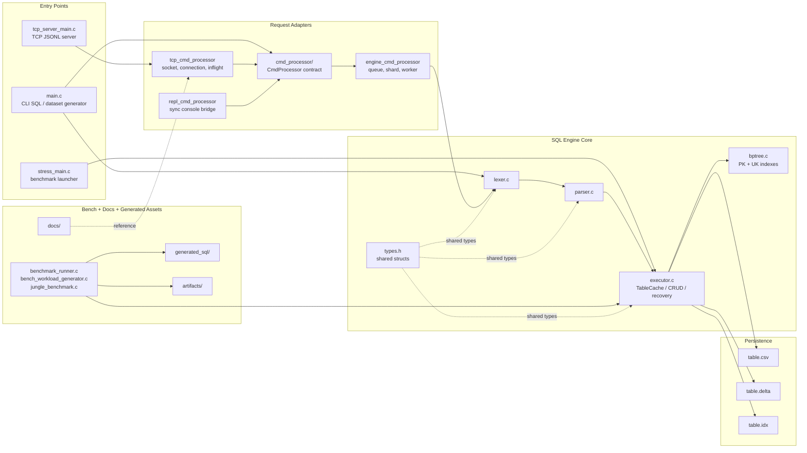
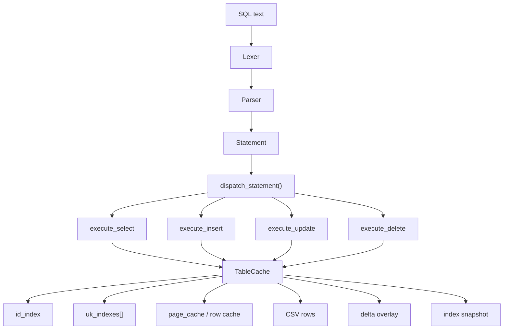
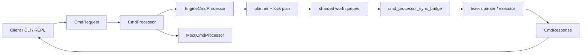

# SQLprocessor Codebase Overview

- Scope: `D:\jungletest\week 7\Sql\SQLprocessor` 현재 코드베이스 전체
- Source: `README.md`, `main.c`, `stress_main.c`, `tcp_server_main.c`, `executor.c`, `types.h`, `Makefile`, `cmd_processor/*`
- Audience: 발표 준비, 신규 팀원 온보딩, 구조 리뷰
- Out of scope: 함수 단위 세부 알고리즘, 개별 테스트 케이스의 모든 assertion, 과거 문서와의 diff

## Summary Band

| Fact | Current state |
| --- | --- |
| Primary language | C 중심, 보조 자동화는 Python/Shell |
| Main entry points | `main.c`, `stress_main.c`, `tcp_server_main.c` |
| Core engine path | `lexer.c` -> `parser.c` -> `executor.c` -> `bptree.c` / CSV / delta / snapshot |
| Runtime frontends | CLI SQL 실행, benchmark runner, TCP JSONL server |
| Main persistence | `.csv`, `.delta`, `.idx`, `artifacts/*.json|md|log` |
| High-risk subsystem | `executor.c` 단일 파일에 캐시, 인덱스, delta replay, snapshot, mutation path가 집중 |

## Grouping Rule

- 리포지토리 단위 overview는 "진입점 / 도메인 엔진 / 인터페이스 어댑터 / 벤치 및 산출물" 기준으로 묶는다.
- 관계선은 major dependency만 표시한다.
- `cmd_processor`는 별도 detail frame으로 분리해서 overview 혼잡도를 낮춘다.

## Primary Overview Frame

## Relation Layer

- `main.c`는 두 역할을 가진다.
  - SQL 파일 실행 시 `CmdProcessor` 기반 경로로 들어간다.
  - `--generate-jungle` 실행 시 데이터 생성기로 빠진다.
- `executor.c`는 이 저장소의 구조 중심이다.
  - `TableCache`와 row cache, page cache, PK/UK index, delta replay, snapshot load/save를 함께 책임진다.
- `cmd_processor`는 엔진 바깥의 요청 수명주기 계층이다.
  - 직접 SQL을 이해하지 않고 request/response 소유권과 비동기 처리 경계만 표준화한다.
- 벤치 계층은 엔진 자체를 검증하는 보조 축이다.
  - `Makefile`, `benchmark_runner.c`, `stress_main.c`, `scripts/*`가 재현 가능한 실행 경로를 만든다.

## Detail Frame A: SQL Engine Slice

### Key files

| Area | Files | Responsibility |
| --- | --- | --- |
| Parse | `lexer.c`, `parser.c`, `parser.h` | SQL subset을 `Statement`로 변환 |
| Shared model | `types.h` | `Statement`, `TableCache`, token, cache constant 정의 |
| Execute | `executor.c`, `executor.h` | SELECT/INSERT/UPDATE/DELETE, recovery, rewrite, cache |
| Index | `bptree.c`, `bptree.h` | 숫자 PK, 문자열 UK exact/range lookup |
| Dataset | `jungle_benchmark.c`, `jungle_benchmark.h` | 정글형 대용량 데이터셋 생성/벤치 지원 |

### Engine structure

### Why this matters

- 구조 설명의 중심 객체는 `Statement`와 `TableCache`다.
- 파서는 SQL 문법 엔진이 아니라 제한된 SQL subset을 안정적으로 `Statement`로 바꾸는 역할에 집중한다.
- 실행기는 "메모리 캐시 + 파일 기반 tail + delta/snapshot 복구"를 함께 다루므로 가장 복합적인 밀집 영역이다.

## Detail Frame B: CmdProcessor Slice

### Ownership map

| Layer | Main files | Owns |
| --- | --- | --- |
| Contract | `cmd_processor/cmd_processor.h`, `.c` | request/response lifecycle, status code, callback contract |
| Async engine adapter | `engine_cmd_processor*.c|h` | request planning, shard queue, worker execution, stats |
| TCP adapter | `tcp_cmd_processor*.c|h`, `tcp_server_main.c` | socket, JSONL framing, connection/inflight limit |
| REPL adapter | `repl_cmd_processor*.c|h`, `sql_repl_engine*.c` | console-style synchronous execution path |
| Sync bridge | `cmd_processor_sync_bridge*.c|h` | 기존 executor 경로와 processor contract 연결 |
| Test doubles/tests | `mock_cmd_processor*`, `*_test.c` | contract 검증, scale score, protocol regression |

### Adapter view

### Why this matters

- 저장소는 단순 SQL 파서 프로젝트를 넘어 "여러 진입점을 받는 request-processing architecture"로 확장되었다.
- `CmdProcessor` 계층을 분리해서 TCP/REPL/CLI의 입력 형식 차이를 엔진 바깥에서 흡수한다.
- 발표 시에는 "SQL 엔진"과 "요청 처리 인터페이스"를 분리해서 설명해야 현재 코드 구조를 왜곡하지 않는다.

## Detail Frame C: Delivery And Verification Surface

| Category | Files/dirs | Notes |
| --- | --- | --- |
| Build orchestration | `Makefile`, `Dockerfile`, `docker-compose.yml` | 기본 빌드, TCP 서버, 벤치, 테스트 경로 제공 |
| Generated workloads | `generated_sql/`, `scripts/generate_jungle_sql_workloads.py` | smoke/regression/score SQL 생성 |
| Benchmark/report | `benchmark_runner.c`, `bench_workload_generator.c`, `artifacts/bench/` | correctness + benchmark + report 묶음 |
| TCP workload test | `scripts/tcp_mixed_workload.py`, `artifacts/tcp_mixed/` | mixed workload 결과와 로그 축적 |
| Architecture references | `docs/sijun-yang/`, `docs/figma-import/`, `docs/*FIGMA*` | 기존 설명 자료와 시각 자산 |

## Figma Section Plan

### Section: `overview`

- Hero title: `SQLprocessor Codebase Overview`
- Summary band: 위 `Summary Band`의 6개 fact를 3x2 카드로 배치
- Main frame: `Primary Overview Frame`

### Section: `subsystems`

- Left: `SQL Engine Slice`
- Right: `CmdProcessor Slice`
- 아래: `Delivery And Verification Surface`

### Section: `detail`

- `executor.c` 집중 설명 카드
- `TableCache` 필드군 묶음 카드
- `CmdProcessor` request/response ownership 카드

### Section: `legend`

- Blue: entry points / adapters
- Green: execution core / data plane
- Orange: storage and persisted artifacts
- Gray dashed line: shared model or documentation reference

## Assumptions And Exclusions

- 이 overview는 현재 워크트리의 코드만 기준으로 한다.
- `docs/` 내부의 설명 문서는 참고 정보이며, 구조의 진실 원천은 C 소스와 `Makefile`이다.
- 상세 함수 호출 그래프나 락 경쟁 분석은 포함하지 않는다.
- `executor.c` 내부 세부 알고리즘은 dense area로 판단하고 detail frame 수준까지만 노출한다.

## Reading Order

1. `Summary Band`에서 프로젝트 성격과 엔트리 포인트를 본다.
2. `Primary Overview Frame`에서 저장소를 네 묶음으로 본다.
3. `Detail Frame A/B`에서 엔진과 요청 처리 계층을 분리해서 읽는다.
4. `Detail Frame C`에서 벤치와 문서 자산이 실제 개발 루프에 어떻게 연결되는지 확인한다.

## Suggested Presenter Script

- "이 저장소는 CSV 기반 SQL 엔진이 중심이지만, 현재 코드는 `CmdProcessor`를 통해 CLI, REPL, TCP 요청 처리까지 흡수하는 구조입니다."
- "핵심 밀집 영역은 `executor.c`이고, 여기서 캐시/인덱스/delta/snapshot이 만납니다."
- "따라서 overview에서는 엔진 본체와 request adapter 계층을 분리해서 보여줘야 구조가 깔끔하게 읽힙니다."
