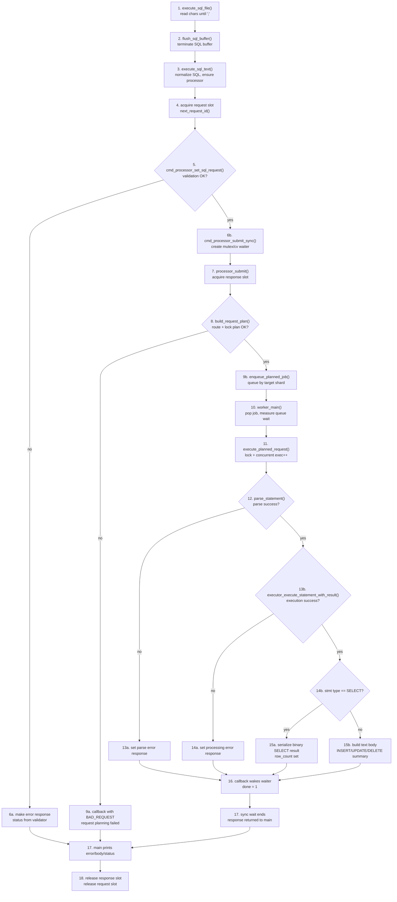

# SQLprocessor Code Flow

- Scenario: `main.c`에서 SQL 한 문장을 읽고 `CmdProcessor`로 동기 제출한 뒤 worker가 실행하고 응답을 반환하는 흐름
- Scope: `execute_sql_file()` -> `flush_sql_buffer()` -> `execute_sql_text()` -> `cmd_processor_submit_sync()` -> `processor_submit()` -> `worker_main()` -> `engine_execute_sql()` -> 응답 출력/해제
- Audience: 발표 준비, 신규 개발자 온보딩, `CmdProcessor` 계층 이해
- Source files:
  - `main.c`
  - `cmd_processor/cmd_processor_sync_bridge.c`
  - `cmd_processor/engine_cmd_processor.c`
  - `cmd_processor/engine_cmd_processor_planner.c`
  - `cmd_processor/engine_cmd_processor_runtime.c`
  - `parser.c`
  - `executor.h`
- Out of scope:
  - `CMD_REQUEST_PING` inline path
  - TCP JSONL framing과 connection lifecycle
  - `try_execute_fast_sql()` 계열 함수
    - 현재 `execute_sql_text()`에서 호출되지 않으므로 본 시나리오에는 포함하지 않음

## Title Block

- Flow name: `CLI SQL Sync Request Path`
- Entry condition: SQL 파일에서 `;`를 만난 시점에 하나의 SQL 문장 버퍼가 완성됨
- Exit condition: CLI가 응답 body 또는 error를 출력하고 request/response slot을 release함
- Primary trace example: `SELECT * FROM users WHERE id = 7;`

## Flow Spine



## Branch Layer

| Decision | Condition | True path | False path |
| --- | --- | --- | --- |
| Request validation | `cmd_processor_set_sql_request() == CMD_STATUS_OK` | sync submit 시작 | validator status로 error response 생성 |
| Planning | `build_request_plan()` 성공 | shard queue로 enqueue | `BAD_REQUEST: request planning failed` |
| Parse | `parse_statement()` 성공 | executor 호출 | `PARSE_ERROR: parse failed` |
| Execute | `executor_execute_statement_with_result()` 성공 | success response 구성 | `PROCESSING_ERROR: execution failed` |
| Response format | `stmt->type == STMT_SELECT` | binary body 직렬화 | text body 요약 생성 |

## State Layer

### Runtime state chips

| State | Before | After | Where it changes |
| --- | --- | --- | --- |
| `g_cmd_processor` | `NULL` 또는 existing | engine processor instance ready | `ensure_cmd_processor()` in `main.c` |
| `RequestSlot.in_use` | `0` | `1` | `processor_acquire_request()` |
| `request.request_id` | empty | `req-<epoch>-<counter>` | `next_request_id()` |
| `SyncSubmitResult.done` | `0` | `1` | `sync_submit_callback()` |
| `RoutePlan` | empty | request class, shard, table name 채워짐 | `build_request_plan()` |
| `LockPlan` | empty | read/write lock target 채워짐 | `build_request_plan()` |
| `CmdJob.enqueue_depth` | unset | queue depth snapshot | `enqueue_planned_job()` |
| `state.current_concurrent_executions` | `n` | `n+1`, then `n` | `execute_planned_request()` |
| `ResponseSlot.message_buffer` | empty | error text 또는 result body | `set_response_error()` / `set_response_body()` |
| `Request/Response slot` | in use | free list로 복귀 | `cmd_processor_release_*()` |

### Important mutations to externalize in Figma

- `request slot acquired`
- `response slot acquired`
- `route_plan.target_shard decided`
- `lock plan mode decided`
- `current_concurrent_executions++ / --`
- `response body format = binary or text`
- `sync waiter done = 1`

## Pseudocode Panel

```text
1. Read SQL file until one statement buffer completes.
2. Normalize the statement and ensure the engine processor exists.
3. Acquire a request slot and attach a generated request id.
4. Validate the SQL request payload.
5. If validation fails, create an error response locally.
6. Otherwise submit synchronously and wait on condition variable.
7. In processor_submit, acquire a response slot.
8. Build a route plan and lock plan from SQL shape.
9. If planning fails, respond with BAD_REQUEST.
10. Otherwise enqueue a job to the selected shard queue.
11. Worker pops the job, measures queue wait, acquires locks.
12. Parse SQL text into Statement.
13. If parse fails, store PARSE_ERROR.
14. Execute Statement through executor.
15. If execution fails, store PROCESSING_ERROR.
16. If success, format SELECT as binary, others as text summary.
17. Callback wakes the sync waiter and returns response to main.
18. Main prints body or error, then releases response and request slots.
```

## Trace Example

### Example input

```sql
SELECT * FROM users WHERE id = 7;
```

### Example trace

1. `execute_sql_file()` accumulates characters until `;`.
2. `flush_sql_buffer()` null-terminates the buffer and calls `execute_sql_text()`.
3. `execute_sql_text()` creates request id like `req-1713770000-1`.
4. `cmd_processor_set_sql_request()` stores SQL into request slot buffer.
5. `cmd_processor_submit_sync()` blocks on `result.done == 0`.
6. `build_request_plan()` sees `SELECT`, extracts table `users`, marks request as read, chooses shard by `hash_text(sql) % shard_count`.
7. `worker_main()` pops the job from that shard queue.
8. `execute_planned_request()` acquires read lock for `users`.
9. `engine_execute_sql()` parses the SELECT into `Statement`.
10. Executor fills `ExecutorResult` with matched rows and selected column data.
11. `set_statement_success_response()` serializes SELECT rows into binary response body.
12. Callback stores `response` and flips `done = 1`.
13. Main thread prints `response->body` and releases both slots.

## Exceptions Frame

### Validation failure

- Trigger: SQL too long or invalid request payload during `cmd_processor_set_sql_request()`
- Result: request is not queued
- Visible output: `cmd_processor_make_error_response()` body/error path only

### Planning failure

- Trigger: unsupported SQL shape in shallow planner
- Result: `BAD_REQUEST` with `"request planning failed"`
- Why it matters: parser/executor 이전에 reject될 수 있음

### Parse failure

- Trigger: `parse_statement()` returns false
- Result: `PARSE_ERROR`
- Why it matters: worker는 lock을 잡은 뒤 parse까지 수행함

### Execution failure

- Trigger: `executor_execute_statement_with_result()` returns false
- Result: `PROCESSING_ERROR`
- Why it matters: parse는 성공했지만 데이터 계층에서 실패한 경우를 분리해 보여줘야 함

## Evidence Layer

| Flow step | Evidence |
| --- | --- |
| file read and statement split | `main.c`: `execute_sql_file()`, `flush_sql_buffer()` |
| request construction | `main.c`: `execute_sql_text()`, `next_request_id()` |
| sync waiting | `cmd_processor/cmd_processor_sync_bridge.c`: `cmd_processor_submit_sync()`, `sync_submit_callback()` |
| request submit | `cmd_processor/engine_cmd_processor.c`: `processor_submit()` |
| planning branch | `cmd_processor/engine_cmd_processor_planner.c`: `build_request_plan()`, `build_sql_plan()` |
| enqueue path | `cmd_processor/engine_cmd_processor.c`: `enqueue_planned_job()` |
| worker path | `cmd_processor/engine_cmd_processor_runtime.c`: `worker_main()` |
| lock + execution state | `cmd_processor/engine_cmd_processor_runtime.c`: `execute_planned_request()` |
| parse branch | `cmd_processor/engine_cmd_processor_runtime.c`: `parse_statement_or_respond()` and `parser.c`: `parse_statement()` |
| success/error response | `cmd_processor/engine_cmd_processor_runtime.c`: `set_response_error()`, `set_statement_success_response()` |

## Figma Section Plan

### Section: `overview`

- Title block
- Flow spine 10-12 cards
- Legend with 4 items

### Section: `trace example`

- Example SQL
- State chips timeline
- Worked example with concrete values

### Section: `exceptions`

- Validation failure
- Planning failure
- Parse failure
- Execution failure

## Legend

- Blue step: main spine action
- Yellow decision: explicit branch condition
- Green state chip: runtime state mutation
- Red exception card: failure path / early exit

## Notes For Figma Build

- Main spine는 top-to-bottom으로 배치한다.
- branch card는 짧게 유지하고 긴 설명은 side note로 뺀다.
- state chip은 flow node 안에 넣지 말고 오른쪽 별도 lane에 둔다.
- `SELECT binary response`와 `non-SELECT text response`를 서로 다른 variant로 표현한다.
