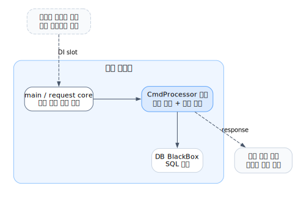
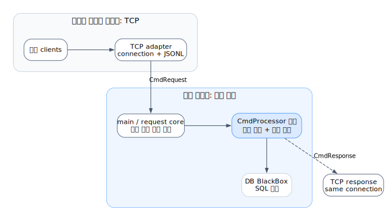
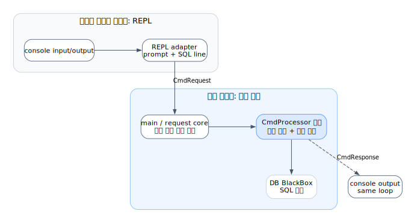
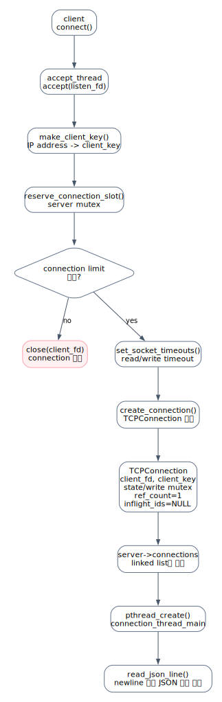
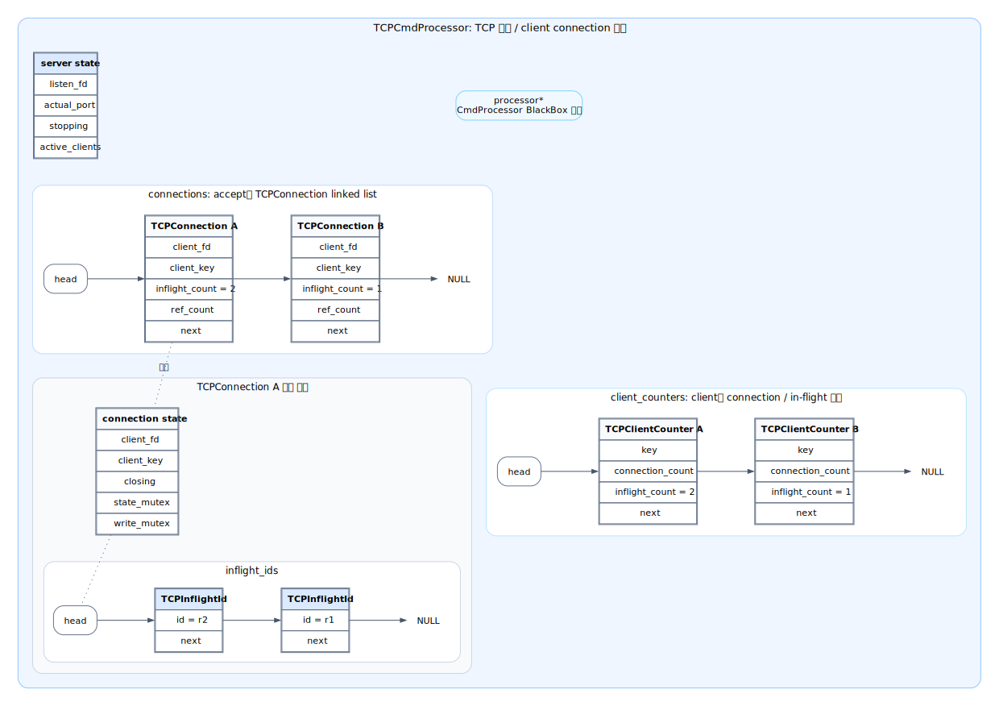
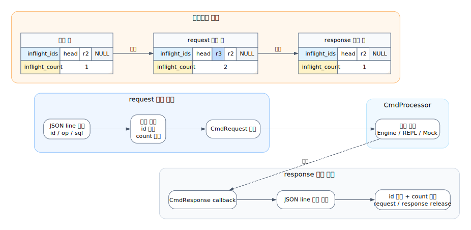
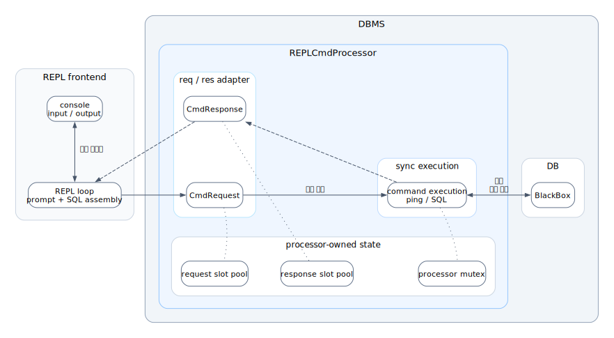

# CmdProcessor 전체 아키텍처와 요청 흐름

이 문서는 TCP 서버만 설명하지 않는다. `CmdProcessor`를 중심으로 입출력 구현체, 공통 계약, 코어 요청 처리 흐름, DB 실행 계층이 어떻게 분리되는지 큰 그림으로 정리한다.

다이어그램 이미지는 `docs/sijun-yang/diagrams/*.dot`을 원본으로 생성한다. 그림에서 DB BlackBox는 내부 구현을 펼치지 않고 역할만 표시한 영역이다.

## 1. 핵심 구조

`CmdProcessor`는 TCP, REPL, 테스트 코드처럼 입력을 받고 출력 형식을 관리하는 구현체와 SQL 실행 계층 사이에 놓인 공통 요청 처리 계약이다.

```text
입출력 구현체
        -> CmdProcessor 공통 계약
        -> 코어 요청 처리 흐름
        -> DB 실행 계층
        -> CmdResponse callback
        -> 입출력 구현체가 출력
```

현재 코드의 주요 구성은 다음과 같다.

| 구성 | 역할 |
| --- | --- |
| `CmdProcessor` | request/response 소유권, 제출, 응답 callback을 정의하는 공통 인터페이스 |
| `TCPCmdProcessor` | TCP connection을 받고 JSONL(newline 구분 JSON) 요청/응답과 `CmdRequest`/`CmdResponse` 사이를 변환하는 어댑터 |
| `EngineCmdProcessor` | 운영용 구현체. 요청을 큐/워커 모델로 처리하고 DB 실행을 조정한다 |
| `REPLCmdProcessor` | REPL용 구현체. 콘솔에서 온 요청을 동기적으로 처리한다 |
| `MockCmdProcessor` | 테스트에서 `CmdProcessor` 계약을 검증하기 위한 구현체 |
| DB 실행 계층 | SQL 파싱, 실행, 테이블/B+Tree 데이터 처리를 담당하는 하위 계층 |

## 2. CmdProcessor 전체 아키텍처


DOT 원본: [`004_cmd_processor_overall_architecture.dot`](./diagrams/004_cmd_processor_overall_architecture.dot)

`CmdProcessor`의 핵심은 입출력 구현체가 코어와 DB의 내부 상태를 몰라도 된다는 점이다. TCP와 REPL은 입력을 `CmdRequest`로 바꾸고 응답을 각자 출력 형식으로 돌려주지만, 계약 뒤쪽의 코어 처리 흐름은 같은 방식으로 연결된다.

역할 경계는 다음처럼 나뉜다.

| 영역 | 책임 |
| --- | --- |
| 입출력 구현체 | 입력 형식을 읽고, 응답을 사용자에게 맞는 형식으로 출력한다 |
| `CmdProcessor` 공통 계약 | request/response 객체의 생명주기와 callback 방식을 통일한다 |
| 코어 요청 처리 흐름 | 요청을 즉시 실행할지, 큐에 넣을지, 어떤 순서로 처리할지 결정한다 |
| DB BlackBox | SQL 의미, 데이터 변경, 저장 구조를 책임진다 |

`submit`이 성공했다는 뜻은 “요청 제출이 성공했다”는 뜻이다. SQL 파싱 실패나 실행 실패 같은 실제 처리 결과는 callback으로 돌아오는 response에 담긴다.

## 3. CmdProcessor를 둔 장점

`CmdProcessor`를 중간 계약으로 두면 입출력을 관리하는 구현체와 코어 요청 처리 흐름을 분리할 수 있다. DI처럼 빌드 또는 실행 구성에서 TCP나 REPL 구현체를 선택하더라도, 선택된 구현체는 같은 `CmdProcessor` 계약을 통해 코어와 DB 실행 흐름에 연결된다.

아래 그림에서는 `CmdProcessor` 계약을 별도 실행 단계가 아니라 구현체와 코어 사이를 오가는 `CmdRequest`/`CmdResponse` 전달 형식으로 표시한다. 코어 박스 안에는 요청 처리 정책을 담당하는 `CmdProcessor`와 그 뒤의 DB 실행 BlackBox를 함께 묶어, 구현체가 코어 내부 구조를 직접 알지 않아도 되는 경계를 보여준다.

### 코어 구현체만 있는 상태



DOT 원본: [`004_cmd_processor_di_core_only.dot`](./diagrams/004_cmd_processor_di_core_only.dot)

코어만 있으면 요청 처리 정책을 담당하는 `CmdProcessor`와 DB 실행 계층은 존재하지만 입출력을 관리할 구현체는 아직 정해지지 않았다. 이 상태에서는 TCP 연결로 응답할지, 콘솔에 출력할지 결정되지 않는다.

### TCP 구현체로 빌드된 상태



DOT 원본: [`004_cmd_processor_di_tcp_build.dot`](./diagrams/004_cmd_processor_di_tcp_build.dot)

TCP 구현체를 선택한 빌드는 client connection에서 JSONL 요청을 읽고, 처리 결과를 같은 connection으로 돌려주는 책임을 가진다. 코어와 DB 쪽 흐름은 TCP를 직접 알지 않고 `CmdProcessor` 계약으로만 연결된다.

### REPL 구현체로 빌드된 상태



DOT 원본: [`004_cmd_processor_di_repl_build.dot`](./diagrams/004_cmd_processor_di_repl_build.dot)

REPL 구현체를 선택한 빌드는 console에서 한 줄 SQL을 읽고, 처리 결과를 다시 console에 출력한다. TCP 빌드와 출력 위치만 다를 뿐, 계약 뒤쪽의 코어와 DB 흐름은 동일하게 유지된다.

## 4. 공통 요청 처리 계약

공통 요청 흐름은 다음과 같다.

```text
request 확보
        -> SQL 또는 ping 요청 채우기
        -> CmdProcessor에 제출
        -> callback으로 response 수신
        -> 구현체의 출력 형식으로 변환
        -> request/response 반환
```

소유권 규칙은 단순하다.

| 객체 | 소유자 | 입출력 구현체의 책임 |
| --- | --- | --- |
| request | `CmdProcessor` 구현체 | 확보한 뒤 내용을 채우고, callback 이후 반환한다 |
| response | `CmdProcessor` 구현체 | callback에서 읽고 반환한다 |
| callback context | 입출력 구현체 | 응답을 어느 connection이나 콘솔로 돌려줄지 기억한다 |

callback은 “처리가 끝났으니 응답을 가져가라”는 신호다. TCP에서는 이 callback context가 connection이고, REPL에서는 콘솔로 결과를 돌려주는 흐름에 해당한다.

## 5. TCP 기반 전체 요청 흐름


DOT 원본: [`004_tcp_cmd_processor_architecture_flow.dot`](./diagrams/004_tcp_cmd_processor_architecture_flow.dot)

TCP 흐름에서 `TCPCmdProcessor`는 DB가 아니다. TCP socket을 관리하고, newline으로 구분된 JSON request를 읽고, 검증한 뒤 `CmdRequest`로 바꿔 `CmdProcessor` 구현체에 넘긴다.

응답은 반대 방향으로 돌아온다. 구현체가 callback으로 `CmdResponse`를 돌려주면, TCP 계층은 이를 JSON 한 줄로 직렬화해서 같은 connection에 쓴다.

## 6. 사용자가 TCP connection을 요청할 때의 흐름



DOT 원본: [`004_tcp_connection_accept_flow.dot`](./diagrams/004_tcp_connection_accept_flow.dot)

client가 접속하면 `TCPCmdProcessor`는 새 socket을 받고, client 주소를 key로 만든 뒤 connection 제한을 확인한다. 제한을 통과하면 socket을 `TCPConnection`으로 감싸 `connections` 목록에 넣고, 해당 connection을 처리할 thread를 시작한다.

기본 connection 제한은 다음과 같다.

| 제한 | 기본값 | 의미 |
| --- | ---: | --- |
| `TCP_MAX_CONNECTIONS_TOTAL` | 128 | 서버 전체 active connection 수 |
| `TCP_MAX_CONNECTIONS_PER_CLIENT` | 4 | 같은 client key의 connection 수 |
| `TCP_READ_TIMEOUT_MS` | 30000 | read timeout |
| `TCP_WRITE_TIMEOUT_MS` | 30000 | write timeout |

## 7. TCPCmdProcessor가 관리하는 상태와 request 반환 흐름



DOT 원본: [`004_tcp_cmd_processor_state_lifecycle.dot`](./diagrams/004_tcp_cmd_processor_state_lifecycle.dot)

`TCPCmdProcessor`는 client TCP connection을 지원한다. 다만 connection 관리는 TCP 계층의 책임이고, `CmdProcessor` 인터페이스 자체가 connection을 아는 것은 아니다. `TCPCmdProcessor`는 connection별 요청을 추적한 뒤 처리만 `processor*` 뒤의 구현체에 위임한다.

저장 상태는 크게 네 묶음이다.

| 상태 | 의미 |
| --- | --- |
| server state | listen socket, 실제 port, 종료 여부, active client 수 |
| `connections` | 현재 열려 있는 `TCPConnection` linked list |
| `client_counters` | client별 connection 수와 처리 중 요청 수 |
| `inflight_ids` | 특정 connection에서 제출됐지만 아직 응답이 끝나지 않은 request id 목록 |

여기서 in-flight는 “요청은 제출됐지만 response callback이 아직 정리되지 않은 상태”를 뜻한다. `inflight_ids`는 배열이 아니라 단방향 linked list다. 새 요청이 등록되면 새 id가 앞쪽에 붙고, 응답이 끝나면 해당 id가 제거된다.



DOT 원본: [`004_tcp_request_response_lifecycle.dot`](./diagrams/004_tcp_request_response_lifecycle.dot)

request가 들어오면 TCP 계층은 먼저 이 요청을 in-flight 상태로 등록할 수 있는지 확인한다.

- connection이 닫히는 중이면 거절한다.
- 같은 connection에서 같은 in-flight id를 다시 쓰면 거절한다.
- connection별 또는 client별 in-flight 제한을 넘으면 거절한다.

등록이 성공하면 `inflight_ids`, connection의 in-flight count, client의 in-flight count가 함께 증가한다. 이후 요청은 `CmdProcessor` 구현체로 넘어간다.

response가 돌아오면 TCP 계층은 같은 connection에 JSON 응답을 쓰고, 등록할 때 증가시킨 상태를 반대로 되돌린다. 마지막으로 processor가 소유한 request/response 버퍼와 callback 동안 붙잡아 둔 connection 참조를 반환한다.

## 8. 여러 요청이 동시에 들어온 상황


DOT 원본: [`004_tcp_multi_request_inflight_flow.dot`](./diagrams/004_tcp_multi_request_inflight_flow.dot)

TCP 계층은 request id를 in-flight 목록에 등록해 두기 때문에 같은 connection 안에서 여러 요청을 추적할 수 있다. 다만 실제로 요청이 겹쳐 처리되는지는 뒤에 연결된 `CmdProcessor` 구현체의 처리 방식에 달려 있다.

- `EngineCmdProcessor`처럼 queue/worker 모델을 쓰면 여러 요청이 동시에 in-flight 상태가 될 수 있다.
- `REPLCmdProcessor`처럼 동기 처리하는 구현체에서는 요청 처리와 callback이 한 흐름 안에서 끝난다.

비동기 처리에서는 응답 순서가 요청 순서와 항상 같지 않다. 클라이언트는 JSON response의 `id`로 어떤 요청의 결과인지 매칭해야 한다. 같은 connection에서 이미 처리 중인 `id`를 다시 보내면 중복 in-flight id로 거절된다.

## 9. TCP 요청/응답 JSON 형식

TCP protocol은 JSONL 방식이다. request와 response는 각각 newline으로 끝나는 JSON object 한 줄이다.

### 요청 형식

| 필드 | 타입 | 필수 | 설명 |
| --- | --- | --- | --- |
| `id` | string | 예 | 요청 식별자. 1바이트 이상, 최대 63바이트 |
| `op` | string | 예 | `"sql"`, `"ping"`, `"close"` 중 하나 |
| `sql` | string | `op="sql"`일 때 | 실행할 SQL 문자열 |

요청 예:

```json
{"id":"s1","op":"sql","sql":"SELECT * FROM users;"}
{"id":"p1","op":"ping"}
{"id":"c1","op":"close"}
```

`close`는 현재 connection만 닫는다. 서버나 다른 connection을 종료하지 않는다.

### 응답 형식

| 필드 | 타입 | 조건 | 설명 |
| --- | --- | --- | --- |
| `id` | string | 항상 | 요청 id. id를 읽지 못한 오류는 `"unknown"` |
| `ok` | boolean | 항상 | 성공 여부 |
| `status` | string | 항상 | 공통 status 문자열 |
| `row_count` | number | 값이 0이 아닐 때 | 조회/매칭 row 수 |
| `affected_count` | number | 값이 0이 아닐 때 | 변경된 row 수 |
| `body` | string/JSON 값 | body가 있을 때 | 처리 결과 본문 |
| `error` | string | 실패 응답일 때 | 오류 메시지 |

응답 예:

```json
{"id":"p1","ok":true,"status":"OK","body":"pong"}
{"id":"s1","ok":true,"status":"OK","row_count":3,"body":"SELECT matched_rows=3"}
{"id":"s3","ok":false,"status":"BAD_REQUEST","error":"missing sql"}
{"id":"r3","ok":false,"status":"BUSY","error":"too many in-flight requests on connection"}
```

## 10. REPLCmdProcessor 내부 구조



DOT 원본: [`004_repl_cmd_processor_structure.dot`](./diagrams/004_repl_cmd_processor_structure.dot)

`REPLCmdProcessor`는 TCP 서버가 아니라 `CmdProcessor` 구현체다. 콘솔 입출력은 REPL 구현체 영역으로 묶고, `REPLCmdProcessor`는 그 입력을 받아 동기적으로 실행한 뒤 response를 돌려준다.

REPL 구조는 TCP보다 단순하다.

- TCP socket, connection list, client별 제한, in-flight id list가 없다.
- request/response 버퍼는 다른 구현체와 같은 소유권 규칙을 따른다.
- 실행은 한 흐름 안에서 끝나며, DB 영역은 BlackBox로 둔다.
