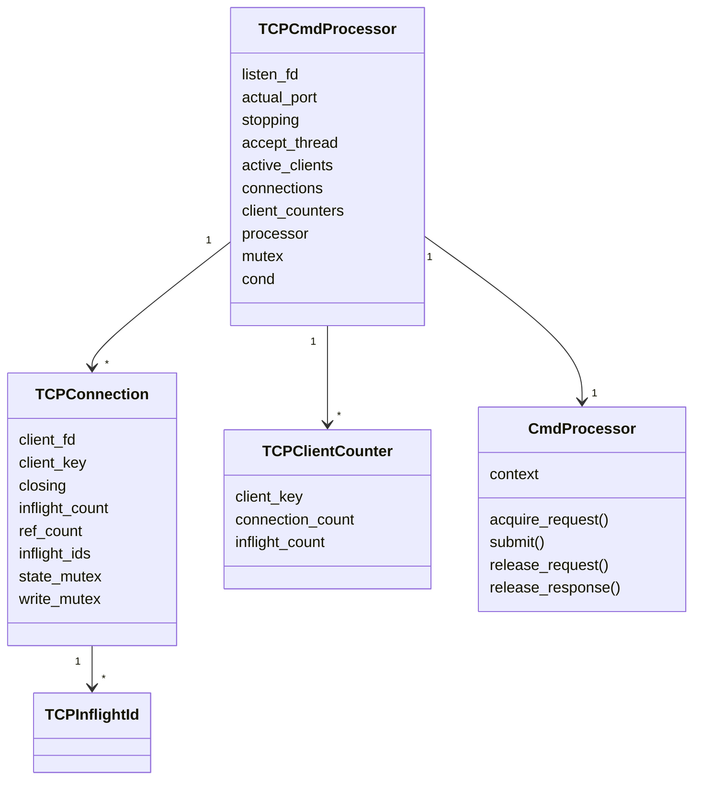
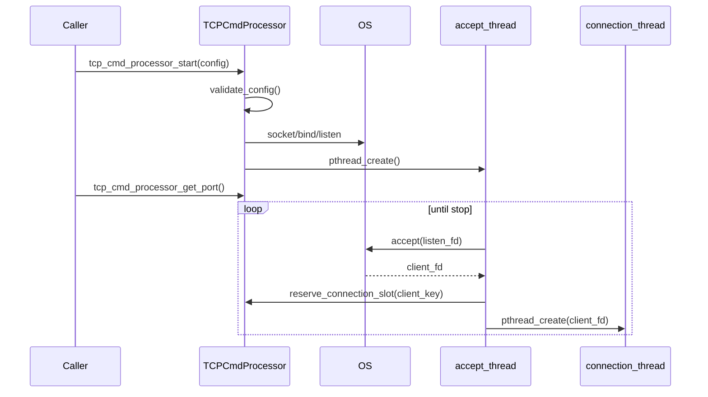
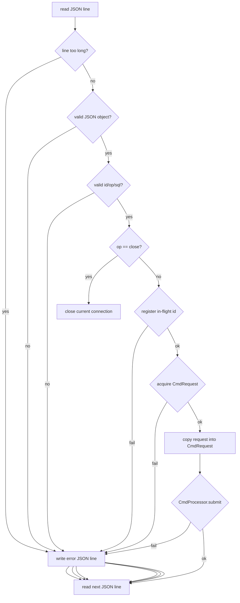
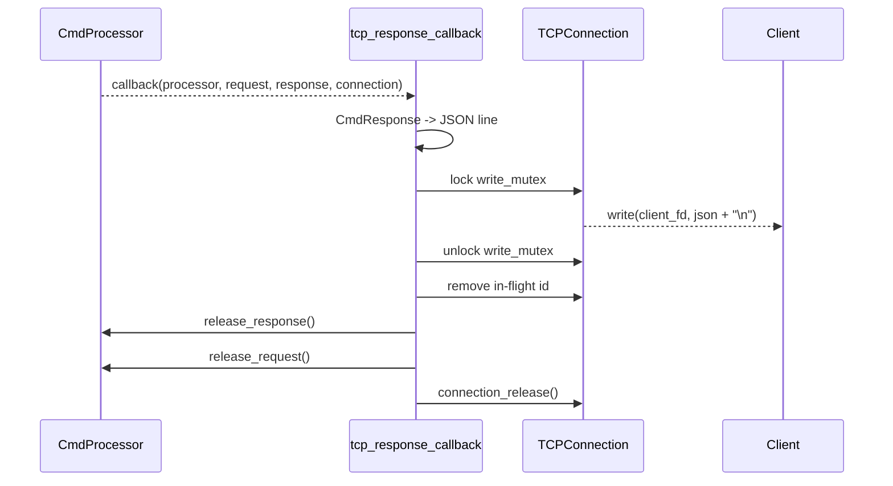
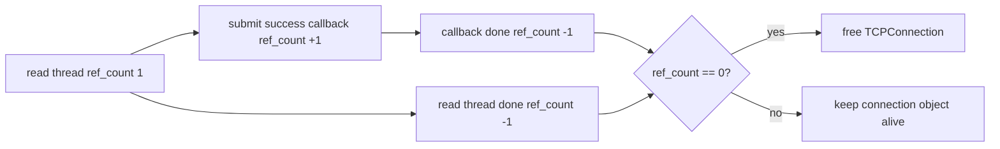
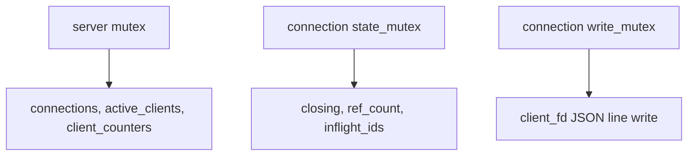
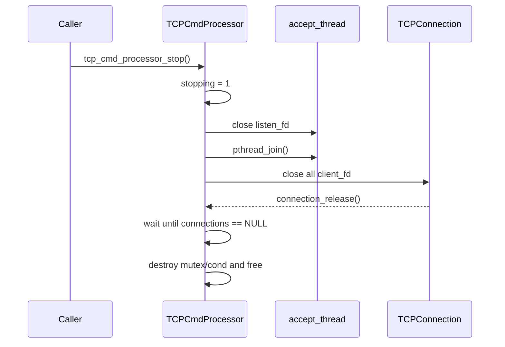

# TCPCmdProcessor Architecture Flow

## 1. 전체 구조

```mermaid
flowchart LR
    Client[TCP Client]
    Server[TCPCmdProcessor]
    Accept[accept thread]
    Conn[connection read thread]
    Parser[cJSON request parser]
    Inflight[in-flight id manager]
    Cmd[CmdProcessor.submit]
    DB[DB 구현체]
    Callback[tcp_response_callback]
    Writer[client_fd writer]

    Client -- JSON line --> Server
    Server --> Accept
    Accept -- accept client_fd --> Conn
    Conn --> Parser
    Parser --> Inflight
    Inflight --> Cmd
    Cmd --> DB
    DB -- CmdResponse --> Callback
    Callback --> Writer
    Writer -- JSON line --> Client
```

TCPCmdProcessor는 TCP 연결, JSONL framing, request id, socket write만 관리한다. DB 실행 순서와 lock 정책은 `CmdProcessor` 뒤쪽 구현체 책임이다.

## 2. 주요 상태

## 3. 서버 시작과 연결 수락

연결 제한은 두 단계로 검사한다.

- 전체 socket 수: `TCP_MAX_CONNECTIONS_TOTAL`
- 같은 client의 socket 수: `TCP_MAX_CONNECTIONS_PER_CLIENT`

## 4. 요청 처리 Flow

`submit()` 성공 후 connection thread는 응답을 기다리지 않고 다음 JSON line을 읽는다. 그래서 같은 connection에서 여러 요청이 동시에 in-flight 상태가 될 수 있다.

## 5. Callback 응답 Flow

응답 순서는 보장하지 않는다. 클라이언트는 응답의 `id`로 원 요청을 매핑해야 한다.

## 6. 수명과 Lock 관계

핵심 규칙:

- in-flight 등록/제거는 server 상태와 connection 상태를 함께 갱신한다.
- 같은 `client_fd`에 대한 write는 `write_mutex`로 보호한다.
- callback이 늦게 와도 `ref_count` 때문에 connection 객체가 먼저 해제되지 않는다.

## 7. 종료 Flow

`op == "close"`는 서버 전체 종료가 아니라 현재 connection만 닫는다.
