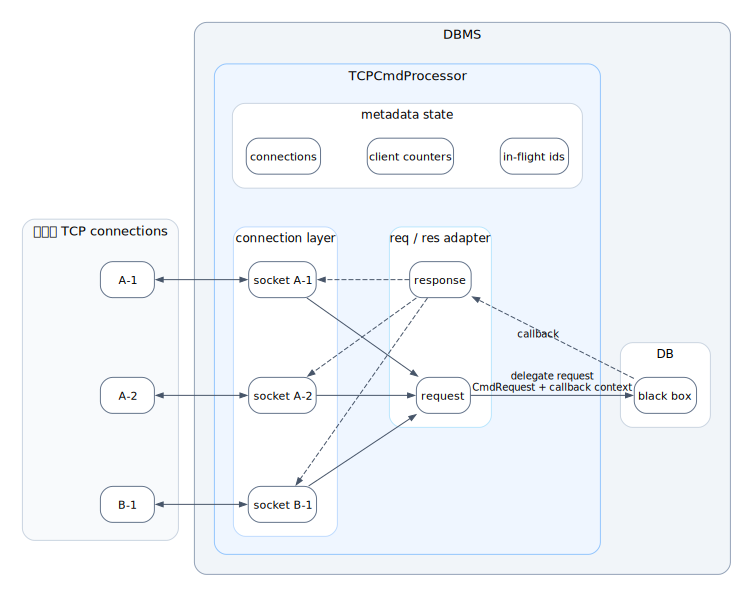
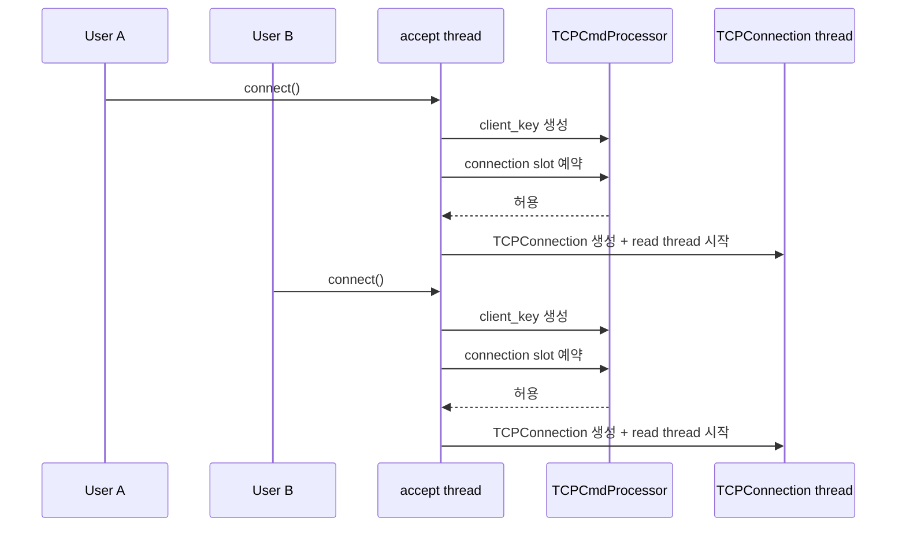
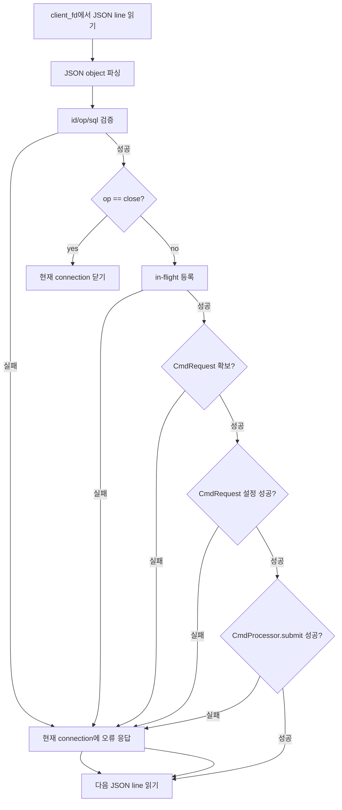
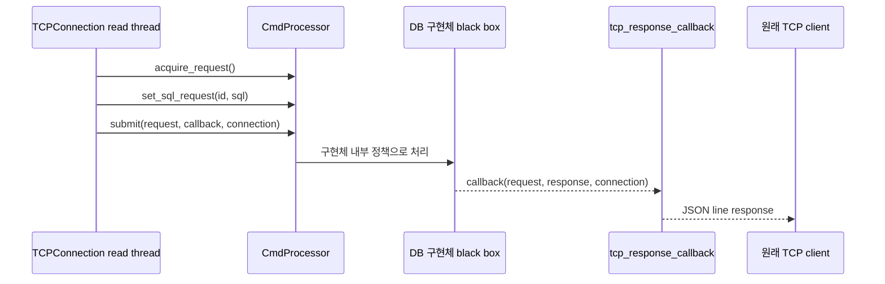
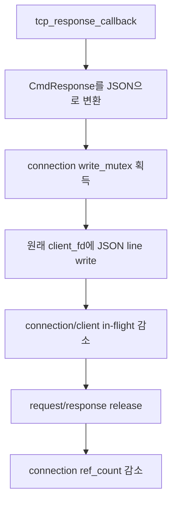

# TCPCmdProcessor: 여러 사용자 연결 관리와 DB 위임 흐름

이 문서는 `TCPCmdProcessor`가 여러 사용자의 TCP connection을 어떻게 관리하고, 들어온 요청을 DB 처리 계층에 어떤 방식으로 넘기는지를 설명한다.

여기서 DB 자체는 블랙박스로 둔다. 즉, SQL 파싱/실행, DB lock, worker queue, transaction 순서, timeout 정책은 이 문서에서 다루지 않는다. TCP 계층은 **연결을 받고, 요청을 검증하고, `CmdProcessor`로 넘기고, callback 응답을 원래 connection에 써주는 역할**만 한다.

## 1. 한 줄 모델

```text
사용자 TCP connection
        -> TCPCmdProcessor
        -> connection별 read thread
        -> JSON line 요청 검증
        -> CmdProcessor.submit()
        -> DB 구현체
        -> response callback
        -> 원래 connection으로 JSON line 응답
```

핵심은 TCP connection과 DB 실행을 분리하는 것이다.

- 사용자는 TCP connection을 하나 이상 열 수 있다.
- 서버는 accepted socket 하나마다 `TCPConnection`을 만든다.
- connection 하나에서는 여러 요청이 동시에 in-flight 상태가 될 수 있다.
- 요청 실행은 `CmdProcessor.submit()` 뒤쪽의 구현체가 결정한다.
- TCP 계층은 DB가 병렬로 실행하는지, 직렬로 실행하는지 알지 않는다.

## 2. 사용자, connection, request 구분

```text
사용자 A
    connection A-1
        request a1
        request a2
    connection A-2
        request a3

사용자 B
    connection B-1
        request b1
```

이 설계에서 구분해야 하는 단위는 세 가지다.

| 단위 | 구현 기준 | 설명 |
| --- | --- | --- |
| client | `client_key` | v1에서는 remote address로 만든다. 같은 IP에서 온 connection들이 같은 client로 묶인다. |
| connection | `TCPConnection` + server-side `client_fd` | `accept()`로 생긴 socket 하나를 나타낸다. |
| request | JSON line의 `id` | connection에서 읽은 명령 하나다. `sql`, `ping`, `close`가 있다. |

`client_fd`는 서버 프로세스 안의 socket fd다. 클라이언트 프로세스가 가진 fd 번호와 같을 필요가 없다.

## 3. 전체 구조



DOT 원본은 [diagrams/004_tcp_cmd_processor_architecture_flow.dot](./diagrams/004_tcp_cmd_processor_architecture_flow.dot)에 둔다.

이 그림은 connection 수락이 끝나고, 여러 사용자의 connection이 이미 `TCPCmdProcessor` 안에 등록된 상태를 기준으로 한다. listen/accept 과정은 연결을 이 상태로 올려놓는 앞단이며, 전체 요청 흐름을 설명하는 이 절에서는 제외한다.

핵심은 connection 자체가 DBMS 안으로 이동하는 것이 아니라는 점이다. `사용자 TCP connections` 블록은 서버 밖의 열린 connection들을 나타내고, `DBMS` 블록 안에는 `TCPCmdProcessor`와 `DB black box`가 있다. `TCPCmdProcessor` 내부의 `connection layer`는 사용자 connection과 1:1로 대응하는 server-side socket session을 관리하고, `metadata state`는 session 목록과 client별 제한을 보조 상태로 관리한다.

이동하는 것은 connection이 아니라 request와 response다. 요청 방향에서는 session이 JSON line을 읽고, `req / res adapter`가 기본 검증과 in-flight 등록을 끝낸 뒤 `CmdRequest`와 callback context를 `CmdProcessor` 경계로 넘긴다. 응답 방향에서는 DB 처리 결과가 callback으로 돌아오고, callback context가 가리키는 원래 session에 JSON line 응답을 쓴다.

| 영역 | 책임 |
| --- | --- |
| connection layer | 이미 연결된 사용자 session들을 유지한다. |
| metadata state | session 목록과 client별 connection/in-flight 제한을 관리한다. |
| req / res adapter | request를 `CmdRequest`로 바꾸고, callback response를 원래 session의 JSON line으로 바꾼다. |
| `CmdProcessor` | 검증된 요청을 DB 처리 계층으로 넘기는 공통 인터페이스다. |
| DB | TCP 계층에서 내부를 알지 않는 처리 계층이다. |

`TCPCmdProcessor`는 `CmdProcessor`를 소유하지 않는다. 서버 종료 시 TCP 자원은 정리하지만, `cmd_processor_shutdown()` 호출 여부는 processor 소유자가 결정한다.

## 4. 여러 사용자의 connection 수락



새 connection을 받을 때 서버는 먼저 `client_key`를 만든다. 현재 구현에서는 remote IP 주소가 `client_key`다.

그 다음 `reserve_connection_slot()`에서 두 제한을 확인한다.

| 제한 | 의미 |
| --- | --- |
| `TCP_MAX_CONNECTIONS_TOTAL` | 서버 전체 active connection 최대 수 |
| `TCP_MAX_CONNECTIONS_PER_CLIENT` | 같은 `client_key`가 열 수 있는 connection 최대 수 |

제한을 넘으면 새로 accept한 `client_fd`는 요청을 읽지 않고 바로 닫는다. 이미 연결되어 있던 다른 사용자나 다른 connection은 영향을 받지 않는다.

주의할 점은 `client_key`가 v1에서 remote IP라는 것이다. 같은 NAT, 같은 로컬 주소, 같은 테스트 프로세스에서 들어온 connection들은 같은 client 제한을 공유할 수 있다.

## 5. connection별 read thread

각 `TCPConnection`은 자기 `client_fd`에서 JSON line을 반복해서 읽는다.



TCP 계층에서 바로 거절하는 요청은 DB로 넘어가지 않는다.

- JSON이 object가 아닌 경우
- `id`가 없거나 비어 있거나 너무 긴 경우
- `op`가 없거나 알 수 없는 값인 경우
- `op=sql`인데 `sql`이 없거나 너무 긴 경우
- 같은 connection에 이미 처리 중인 같은 `id`가 있는 경우
- connection별 또는 client별 in-flight 제한을 넘은 경우

`op=close`는 서버 전체 종료가 아니라 현재 connection만 닫는다.

## 6. in-flight 관리

`submit()`이 성공하면 read thread는 응답을 기다리지 않고 다음 JSON line을 읽는다. 그래서 하나의 connection에도 여러 요청이 동시에 in-flight 상태로 남을 수 있다.

```text
connection A-1:
    req a1 -> submit 완료, 응답 대기 중
    req a2 -> submit 완료, 응답 대기 중

connection B-1:
    req b1 -> submit 완료, 응답 대기 중
```

in-flight 등록 시 서버는 두 종류의 카운터를 갱신한다.

| 카운터 | 목적 |
| --- | --- |
| `connection->inflight_count` | 특정 connection 하나가 너무 많은 요청을 밀어 넣지 못하게 제한 |
| `TCPClientCounter.inflight_count` | 같은 client가 여러 connection을 열어도 전체 in-flight 수를 제한 |

그리고 connection 안에는 처리 중인 request id 목록이 있다. 현재 중복 id 검사는 **같은 connection 안의 in-flight id** 기준이다. 서로 다른 connection에서 같은 `id`를 쓰는 것은 TCP 계층에서 전역 중복으로 보지 않는다. 클라이언트는 자기 connection에서 보낸 요청과 응답의 `id`를 매핑해야 한다.

## 7. DB로 위임되는 지점

TCP 계층이 DB에 요청을 넘기는 유일한 경계는 `CmdProcessor` API다.

```text
cmd_processor_acquire_request(processor, &cmd_request)
cmd_processor_set_sql_request(processor, cmd_request, request_id, sql)
cmd_processor_submit(processor, cmd_request, tcp_response_callback, connection)
```

`CmdRequest`에 담기는 정보는 외부 요청의 공통 모델이다.

| 필드 | 의미 |
| --- | --- |
| `request_id` | 클라이언트가 보낸 `id`, 응답에도 같은 값이 들어간다. |
| `type` | `CMD_REQUEST_SQL` 또는 `CMD_REQUEST_PING` |
| `sql` | SQL 요청일 때의 SQL 문자열 |

현재 공용 `CmdRequest`에는 `client_key`, `client_fd`, 사용자 인증 정보가 들어가지 않는다. TCP 계층은 connection context를 callback용 `user_data`로 넘기지만, DB 구현체는 이것을 해석하지 않는 opaque callback context로 취급해야 한다.

## 8. DB 블랙박스 계약



`cmd_processor_submit()`의 반환값은 처리 결과가 아니라 **제출 성공 여부**다.

- `0`: 요청이 processor 구현체에 제출됐다. 이후 결과는 callback으로 온다.
- `-1`: 제출 자체가 실패했다. 이 경우 callback은 오지 않는 것으로 보고 TCP 계층이 오류 응답을 쓴다.

SQL 문법 오류, 실행 오류, DB busy, timeout 같은 처리 결과는 callback으로 전달되는 `CmdResponse.status`에 담긴다.

TCP 계층이 DB에 대해 가정하지 않는 것:

- 요청을 실제로 몇 개 worker가 처리하는지
- 요청을 병렬 실행하는지 직렬 실행하는지
- SQL별 lock을 어떻게 잡는지
- 같은 client의 요청을 우선 처리하는지
- callback이 어느 thread에서 호출되는지
- 응답 순서가 submit 순서와 같은지

따라서 응답 순서는 보장하지 않는다. 클라이언트는 반드시 응답의 `id`로 원 요청을 찾아야 한다.

## 9. 응답이 돌아오는 방식

DB 구현체가 처리를 끝내면 `tcp_response_callback()`이 호출된다. callback은 `CmdResponse`를 TCP 응답 JSON으로 바꾸고, 원래 connection의 `client_fd`에 JSON line을 쓴다.



응답 JSON은 대략 다음 형태다.

```json
{"id":"a1","ok":true,"status":"OK","body":{"rows":[]}}
```

실패 시에는 `ok=false`, `status`, `error`가 들어간다.

같은 connection의 여러 요청이 서로 다른 thread에서 callback될 수 있으므로, socket write는 `connection->write_mutex`로 보호한다. 이 lock은 JSON line들이 같은 `client_fd`에 섞여 쓰이는 것을 막는다.

## 10. connection 수명과 늦은 callback

요청이 `CmdProcessor`로 넘어간 뒤에도 클라이언트가 connection을 닫을 수 있다. 그래서 submit 직전에 `connection_add_ref()`로 connection 객체 수명을 늘린다.

```text
read thread가 connection ref 1개 보유
submit 성공 요청마다 callback용 ref 1개 추가
read thread 종료 시 ref 1개 반환
callback 종료 시 ref 1개 반환
ref_count가 0이 되면 TCPConnection 해제
```

이 덕분에 connection fd가 이미 닫혔더라도, 늦게 도착한 callback이 해제된 `TCPConnection` 메모리를 만지는 상황을 막는다.

connection이 이미 closing이면 응답 write는 실패하거나 생략될 수 있다. 그래도 callback은 반드시 in-flight 제거, request/response 반환, connection ref 반환을 수행한다.

## 11. connection 종료와 서버 stop

connection은 다음 경우에 닫힌다.

- 클라이언트가 EOF를 보낸 경우
- read/write가 실패한 경우
- `op=close` 요청을 받은 경우
- `tcp_cmd_processor_stop()`이 열린 connection들을 닫는 경우

connection이 닫히면 `client_fd`는 shutdown/close되고 `closing` 상태가 된다. 다만 이미 `CmdProcessor`로 넘어간 요청이 남아 있으면 `TCPConnection` 객체는 callback들이 끝날 때까지 유지된다.

`op=close`는 현재 connection만 닫는다. 같은 사용자의 다른 connection이나 다른 사용자의 connection은 닫지 않는다.

`tcp_cmd_processor_stop()`은 서버 전체 종료다.

1. 새 connection을 더 받지 않도록 `stopping`을 켠다.
2. `listen_fd`를 닫고 accept thread를 join한다.
3. 현재 등록된 모든 connection의 `client_fd`를 닫는다.
4. 모든 `TCPConnection` 객체가 정리될 때까지 기다린다.

여기서도 DB 내부 취소 정책은 TCP 계층이 결정하지 않는다. 이미 DB로 넘어간 요청을 취소할지, 끝까지 처리한 뒤 callback할지는 `CmdProcessor` 뒤쪽 구현체 책임이다.

## 12. 여러 사용자 요청 예시

```text
User A, connection A-1:
    {"id":"a1","op":"sql","sql":"SELECT ..."}
    {"id":"a2","op":"sql","sql":"UPDATE ..."}

User A, connection A-2:
    {"id":"a3","op":"ping"}

User B, connection B-1:
    {"id":"b1","op":"sql","sql":"INSERT ..."}
```

TCP 계층에서 일어나는 일:

1. `A-1`, `A-2`, `B-1`은 각각 별도 `TCPConnection`으로 등록된다.
2. User A는 같은 `client_key`의 connection 2개를 사용하므로 client별 connection count를 공유한다.
3. `a1`, `a2`, `a3`, `b1`은 각각 in-flight로 등록된다.
4. 네 요청은 모두 같은 `CmdProcessor` 인스턴스에 submit된다.
5. DB 구현체가 어떤 순서로 처리할지는 TCP 계층이 관여하지 않는다.
6. 응답은 callback에 함께 넘긴 connection context를 통해 원래 connection으로 돌아간다.

가능한 응답 순서는 다음처럼 submit 순서와 달라도 정상이다.

```text
B-1 receives response b1
A-1 receives response a2
A-2 receives response a3
A-1 receives response a1
```

클라이언트는 `id`로 응답을 매칭해야 한다.

## 13. 책임 경계 정리

| 책임 | TCP 계층 | CmdProcessor/DB 구현체 |
| --- | --- | --- |
| TCP accept/listen | 담당 | 해당 없음 |
| connection 수 제한 | 담당 | 해당 없음 |
| client별 connection/in-flight 제한 | 담당 | 해당 없음 |
| JSON line framing | 담당 | 해당 없음 |
| request id 기본 검증 | 담당 | 해당 없음 |
| SQL 길이 사전 검증 | 담당 | 최종 검증 가능 |
| SQL 파싱/실행 | 하지 않음 | 담당 |
| DB lock/worker/queue | 하지 않음 | 담당 |
| 처리 결과 생성 | 하지 않음 | 담당 |
| 응답 JSON 직렬화 | 담당 | `CmdResponse`까지만 제공 |
| 같은 fd write 보호 | 담당 | 해당 없음 |
| request/response 객체 소유 | release만 호출 | 소유 |

결론적으로 `TCPCmdProcessor`는 여러 사용자의 connection을 안정적으로 받아 `CmdProcessor`로 요청을 흘려보내는 adapter다. DB는 `CmdProcessor` 뒤에 있는 블랙박스이며, TCP 계층은 DB 내부 실행 구조를 알 필요도 없고 알아서도 안 된다.
